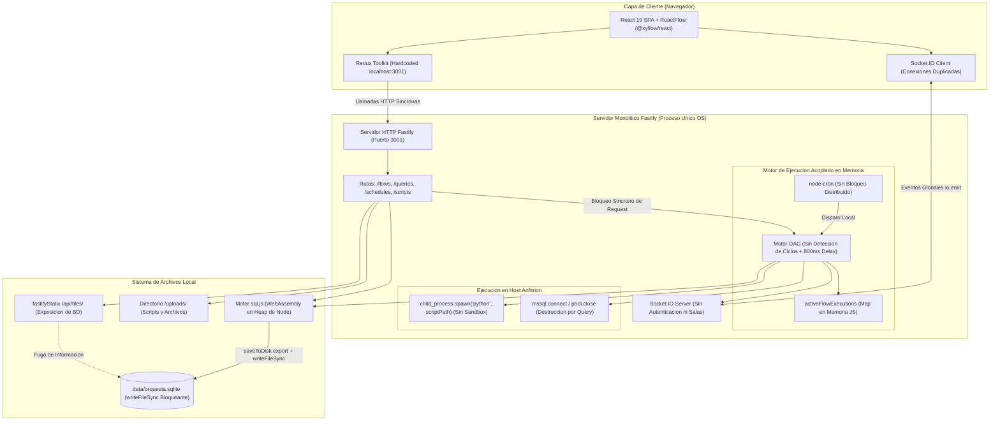
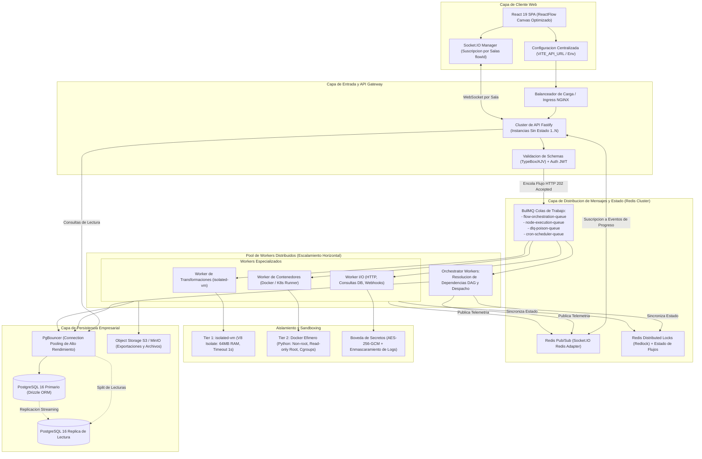

# INFORME DE AUDITORIA TECNICA, ESCALABILIDAD DISTRIBUIDA E INNOVACION FUNCIONAL: ORQUESTAFLOW

Documento de Consolidacion Arquitectonica y Plan de Evolucion a Produccion
Version: 1.0.0 Definitiva
Fecha de Publicacion: 2026-09-05
Entorno de Analisis: c:\Users\Jose\Desktop\orquestaFlow
Clasificacion: Documento Tecnico de Arquitectura y Diseno de Sistemas

---

## INDICE DE CONTENIDOS

1. INTRODUCCION Y RESUMEN EJECUTIVO
   1.1 Mision y Alcance de la Auditoria
   1.2 Metodologia de Inspeccion de Codigo y Criterios de Evaluacion
   1.3 Diagnostico Global del Estado Actual de OrquestaFlow

2. SECCION 1: AUDITORIA TECNICA Y PUNTOS DE MEJORA (R1)
   2.1 Frontend (React 19, @xyflow/react, Redux Toolkit, Tailwind CSS)
       2.1.1 Ruptura de Memoizacion e Inestabilidad de Referencias en el Canvas
       2.1.2 Granularidad Deficiente de Selectores Redux en BaseNode
       2.1.3 Cascada de Re-renderizados por Keystroke en NodeInspector
       2.1.4 Contradiccion de UI: Desactivacion Forzada de Controls y MiniMap por CSS
       2.1.5 Semantica de Handles Uniformes y Modo Loose de Conexion
       2.1.6 Monolitos de Componentes y Complejidad Ciclomatica Excesiva
       2.1.7 Acoplamiento Fragil por DOM Event Bus (window.dispatchEvent)
       2.1.8 Estado Dual Desincronizado entre Redux Toolkit y ReactFlow
       2.1.9 Dispersion de Endpoints Hardcodeados a Localhost (15+ Ocurrencias)
       2.1.10 Multiplicidad de Conexiones WebSocket sin Aislamiento de Salas (Rooms)
       2.1.11 Diagnosticos del Compilador de React 19 y Alertas de Linter (Oxlint)
       2.1.12 Experiencia de Usuario, Resiliencia y Ergonomia
   2.2 Backend (Fastify, sql.js, Motor DAG, Scheduler, Sockets, Seguridad)
       2.2.1 Exposicion Critica de la Base de Datos SQLite via FastifyStatic
       2.2.2 Politicas de CORS Hardcodeadas y Ausencia de Validacion de Schemas
       2.2.3 Apagado Incompleto (Graceful Shutdown Deficitario)
       2.2.4 Persistencia Sincrona Bloqueante con sql.js (saveToDisk)
       2.2.5 Riesgo Severo de Corrupcion de Datos por Escritura no Atomica
       2.2.6 Crecimiento Ilimitado de Memoria por Execution Logs en el Heap
       2.2.7 Bloqueo Infinito y Deadlock por Ciclos en el Motor DAG (Kahn)
       2.2.8 Omision de Despacho de Nodos Query (Codigo Muerto en Switch)
       2.2.9 Colision de Concurrencia por Clave de Ejecucion Unica (flowId)
       2.2.10 Delays Artificiales de 800ms y Respuestas Simuladas (Mock Bypass)
       2.2.11 Ausencia de Cancelacion en Ramas Hermanas ante Fallos (Orphan Tasks)
       2.2.12 Peticiones HTTP sin Timeout de Red y Bloqueos de Proceso
       2.2.13 Falla de Terminacion de Procesos Hijos en Plataformas Windows
       2.2.14 Superposicion de Tareas Programadas (node-cron) sin Exclusion Mutua
       2.2.15 Inconsistencia Critica de Rutas en scheduler.ts (scripts/scripts/...)
       2.2.16 Broadcast Global Inseguro en Socket.IO sin Canales Aislados
       2.2.17 Ejecucion Arbitraria de Codigo (RCE) en Modulo de Scripts
       2.2.18 Vulnerabilidad de Path Traversal en Vista Previa de Archivos
       2.2.19 Almacenamiento y Exposicion de Credenciales en Texto Plano
       2.2.20 Destruccion y Recreacion de Connection Pools MSSQL por Query

3. SECCION 2: ESTRATEGIA Y ARQUITECTURA DE ESCALABILIDAD (R2)
   3.1 Diagramas Arquitectonicos en Notacion Mermaid
       3.1.1 Diagrama 1: Arquitectura Actual (Monolitica, en Memoria, Acoplada)
       3.1.2 Diagrama 2: Arquitectura Propuesta (Distribuida, Desacoplada, Escalable)
   3.2 Transicion de Base de Datos: de sql.js a PostgreSQL
       3.2.1 Evaluacion Comparativa Rigurosa: Drizzle ORM vs. Prisma ORM
       3.2.2 Modelo de Datos Relacional Completo (DDL PostgreSQL en Produccion)
       3.2.3 Hoja de Ruta de Migracion en 4 Fases con Retrocompatibilidad
   3.3 Desacoplamiento del Motor de Ejecucion (BullMQ + Redis)
       3.3.1 Topologia de Colas de Mensajeria y Responsabilidades
       3.3.2 Ciclo de Vida y Transiciones de Estado de Jobs
       3.3.3 Streaming de Eventos en Tiempo Real con Redis Pub/Sub y Socket.IO Adapter
   3.4 Resiliencia, Aislamiento y Sandboxing
       3.4.1 Matriz Comparativa de Tecnologias de Aislamiento
       3.4.2 Arquitectura de Sandboxing en Dos Niveles (Tier 1 y Tier 2)
       3.4.3 Politicas de Reintento con Backoff Exponencial y Jitter
       3.4.4 Dead Letter Queues (DLQ), Timeouts Granulares y Circuit Breakers

4. SECCION 3: CATALOGO DE NUEVAS FUNCIONALIDADES E INNOVACIONES (R3)
   4.1 Catalogo y Especificacion Tecnica de Nuevos Tipos de Nodos
       4.1.1 Nodo conditionalBranch (If/Else, Switch)
       4.1.2 Nodo forEachLoop (Iterador en Lote y Paralelo)
       4.1.3 Nodo jsonTransform (Motor JQ, JSONPath, JavaScript)
       4.1.4 Nodo webhookTrigger (Validacion Timing-Safe HMAC-SHA256)
       4.1.5 Nodo oauth2Connector (PKCE, Client Credentials, Ciclo de Refresco)
       4.1.6 Nodo aiChatCompletion (Soporte Multi-Proveedor y Tool Calling)
   4.2 Funcionalidades Avanzadas de Plataforma
       4.2.1 Versionado Inmutable de Flujos e Historial de Ejecucion
       4.2.2 Modo Debug Interactivo Paso a Paso (Breakpoints y Pausa)
       4.2.3 Boveda Central de Secretos (AES-256-GCM y Enmascaramiento de Logs)
       4.2.4 Catalogo de Plantillas Prefabricadas y Wizard de Parametrizacion
   4.3 Matriz de Priorizacion y Hoja de Ruta de Implementacion
       4.3.1 Matriz 2x2 Impacto vs. Esfuerzo
       4.3.2 Plan Secuencial de Hitos (Milestones 1 al 6)

5. SECCION 4: PLAN DE ACCION Y CONCLUSIONES
   5.1 Sintesis Ejecutiva de Hallazgos
   5.2 Guias de Implementacion Inmediata
   5.3 Metodos de Verificacion y Criterios de Aceptacion

---

# 1. INTRODUCCION Y RESUMEN EJECUTIVO

## 1.1 Mision y Alcance de la Auditoria

OrquestaFlow es una plataforma de orquestacion de flujos de datos y automatizacion visual concebida para integrar consultas a bases de datos relacionales (Microsoft SQL Server), extraccion y transformacion de datos mediante scraping y scripts en lenguaje Python, peticiones hacia APIs HTTP externas, ejecucion programada mediante expresiones cron y exportacion de resultados hacia formatos estructurados (CSV, Excel).

El proposito de esta auditoria integral es evaluar la arquitectura de software actual de OrquestaFlow tanto a nivel de cliente (Frontend) como de servidor (Backend), identificando vulnerabilidades de seguridad, cuellos de botella de concurrencia e I/O, anti-patrones de diseno reactivo, limites de escalabilidad vertical y horizontal, y carencias de resiliencia operativa. Sobre la base del diagnostico empirico del codigo fuente existente, este documento consolida un plan formal, detallado y ejecutable para evolucionar la solucion desde su estado actual de prototipo de escritorio hacia una arquitectura distribuida de nivel empresarial apta para cargas masivas y entornos de alta disponibilidad.

## 1.2 Metodologia de Inspeccion de Codigo y Criterios de Evaluacion

La evaluacion fue conducida mediante un analisis estatico y dinamico exhaustivo sobre las bases de codigo localizadas en `frontend/` y `backend/`. El procedimiento metodologico contemplo:

1. **Inspeccion Manual Linea por Linea:** Revision de los archivos fuente principales (`executor.ts`, `scheduler.ts`, `database.ts`, `mssql.ts`, `server.ts`, `FlowEditor.tsx`, `NodeInspector.tsx`, `BaseNode.tsx`, `flowSlice.ts`, entre otros), contrastando la implementacion contra las mejores practicas de la industria en sistemas concurrentes y reactivos.
2. **Evaluacion de Compilacion y Linters:** Ejecucion y diagnostico de herramientas estaticas modernas (incluyendo Oxlint y validaciones de compatibilidad con el compilador de React 19), registrando advertencias sobre reglas de preservacion de memoizacion y efectos con mutacion en cascada.
3. **Mapeo de Rutas de Flujo de Datos y Dependencias:** Rastreo de la traza completa desde la interaccion del usuario en el canvas de ReactFlow hasta la persistencia en disco y ejecucion de subprocesos del sistema operativo.
4. **Modelado de Amenazas y Seguridad Defensiva:** Identificacion de vectores de Inyeccion de Comandos (RCE), Travesia de Directorios (Path Traversal), Filtracion de Datos Sensibles en Texto Plano y Exfiltracion de Artefactos de Base de Datos.

## 1.3 Diagnostico Global del Estado Actual de OrquestaFlow

OrquestaFlow cuenta con una interfaz grafica moderna y funcional sustentada en React 19, Tailwind CSS y `@xyflow/react`, asi como una API rapida basada en Fastify. No obstante, el sistema se encuentra restringido por decisiones arquitectonicas orientadas exclusivamente a ejecuciones locales de un unico usuario:

- **Frontend:** El canvas de diseno sufre de degradacion severa de rendimiento debido a la asignacion continua de objetos literales en componentes no memoizados, selectores Redux de granularidad gruesa y la falta de un buffer local con debounce en los campos de configuracion. La interaccion entre nodos y modales evade los patrones idiomaticos de React a traves de eventos globales en el objeto `window`.
- **Backend:** La persistencia descansa sobre `sql.js` (SQLite compilado a WebAssembly en memoria), el cual ejecuta una exportacion binaria completa y una escritura sincrona a disco (`writeFileSync`) en cada mutacion. El motor de ejecucion DAG carece de deteccion de ciclos, cuelga peticiones HTTP sincronicamente, keyea ejecuciones concurrentes bajo el identificador estatico del flujo, y ejecuta scripts de Python sin ningun tipo de sandbox en el sistema operativo anfitrion.
- **Seguridad e Infraestructura:** La base de datos completa `orquesta.sqlite` es accesible publicamente mediante rutas estaticas, las credenciales de bases de datos externas se guardan en texto claro, y las conexiones a SQL Server sufren sobrecostos extremos por la destruccion continua de pools de conexion.

---

# 2. SECCION 1: AUDITORIA TECNICA Y PUNTOS DE MEJORA (R1)

Esta seccion documenta los hallazgos especificos resultantes de la auditoria de codigo fuente, proporcionando ubicaciones exactas, lineas de codigo, citas textuales y el analisis del impacto tecnico asociado.

## 2.1 Frontend (React 19, @xyflow/react, Redux Toolkit, Tailwind CSS)

### 2.1.1 Ruptura de Memoizacion e Inestabilidad de Referencias en el Canvas
- **Ubicacion:** `frontend/src/components/flow/nodes/index.tsx` (Lineas 5-31) y `frontend/src/components/flow/nodes/BaseNode.tsx` (Linea 24).
- **Evidencia en Codigo:**
  ```tsx
  // frontend/src/components/flow/nodes/index.tsx
  export const StartNode = (props: any) => (
    <BaseNode {...props} type="start" data={{ ...props.data, icon: Play }} />
  );
  export const HttpNode = (props: any) => (
    <BaseNode {...props} type="httpRequest" data={{ ...props.data, icon: Globe }} />
  );
  export const ScrapingNode = (props: any) => (
    <BaseNode {...props} type="scraping" data={{ ...props.data, icon: Terminal }} />
  );
  ```
- **Analisis de Impacto:** En cada ciclo de render del canvas de ReactFlow (producido por paneo, zoom, seleccion o movimiento de nodos), los componentes envolventes instancian una nueva referencia en memoria para el objeto `data` mediante `{ ...props.data, icon: Play }`. Adicionalmente, ni `BaseNode` ni los wrappers de `index.tsx` estan protegidos por `React.memo`. Dado que `@xyflow/react` utiliza comparaciones por igualdad superficial (`prevProps.data === nextProps.data`) para omitir renders innecesarios, esta asignacion inline invalida cualquier optimizacion de memoizacion. Como resultado, cada nodo del flujo se renderiza de nuevo ante cualquier evento de navegacion en el canvas, consumiendo ciclos de CPU y generando caidas perceptibles en la tasa de refresco (frame drops).

### 2.1.2 Granularidad Deficiente de Selectores Redux en BaseNode
- **Ubicacion:** `frontend/src/components/flow/nodes/BaseNode.tsx` (Lineas 25-30).
- **Evidencia en Codigo:**
  ```tsx
  const executing = useAppSelector(state => state.flows.executingNodeIds.includes(id));
  const completed = useAppSelector(state => state.flows.completedNodeIds.includes(id));
  const hasError = useAppSelector(state => state.flows.errorNodeIds.includes(id));
  const nodeResult = useAppSelector(state => state.flows.nodeResults[id]);
  const progress = useAppSelector(state => state.flows.nodeProgress[id]);
  const timerState = useAppSelector(state => state.flows.nodeTimers[id]);
  ```
- **Analisis de Impacto:** Cada nodo en el canvas monta seis selectores independientes de Redux. Los estados `executingNodeIds`, `completedNodeIds` y `errorNodeIds` son arreglos en `flowSlice.ts`. Cada vez que el motor de ejecucion emite un evento WebSocket actualizando el progreso (`flow-progress`) o la cuenta regresiva de un temporizador en un solo nodo especifico (ej. Nodo A), las referencias de estos arreglos y diccionarios mutan en el estado global. Aunque los demas nodos (B, C, D) no hayan cambiado de estado, sus selectores se re-ejecutan y fuerzan un re-render de todos los nodos del canvas. En grafos de mas de 20 nodos con ejecucion por lotes o timers activos, esto induce una saturacion severa en el hilo principal de renderizado de React.

### 2.1.3 Cascada de Re-renderizados por Keystroke en NodeInspector
- **Ubicacion:** `frontend/src/components/flow/NodeInspector.tsx` (Lineas 264-273).
- **Evidencia en Codigo:**
  ```tsx
  const updateNodeData = (key: string, value: any) => {
    setNodes(nds =>
      nds.map(n => {
        if (n.id === selectedNodeId) {
          return { ...n, data: { ...n.data, [key]: value } };
        }
        return n;
      })
    );
  };
  ```
- **Analisis de Impacto:** En el panel lateral de inspeccion de nodos, los campos de entrada de texto (como URL del endpoint, encabezados HTTP, parametros y cuerpo de la peticion) invocan directamente `updateNodeData` en su evento `onChange`. No existe ningun tipo de buffer en el estado local del componente ni funcion de debounce. En consecuencia, cada pulsacion de tecla (`keystroke`) muta el arreglo `nodes` que reside en el componente padre `FlowEditor.tsx` (linea 98). Esto fuerza un ciclo de render completo sobre todo el canvas de ReactFlow y sobre cada uno de los nodos visuales, introduciendo latencia de tipeo y sensacion de lentitud extrema.

### 2.1.4 Contradiccion de UI: Desactivacion Forzada de Controls y MiniMap por CSS
- **Ubicacion:** `frontend/src/components/flow/FlowEditor.tsx` (Lineas 873-878) frente a `frontend/src/index.css` (Lineas 99-105).
- **Evidencia en Codigo:**
  ```tsx
  // frontend/src/components/flow/FlowEditor.tsx
  <Controls className="!bg-surface !border-border !shadow-sm !rounded-sm" />
  <MiniMap 
    nodeColor="#e5e5e5"
    maskColor="rgba(250, 250, 250, 0.7)"
    className="!bg-surface !border-border !rounded-sm !shadow-sm" 
  />
  ```
  ```css
  /* frontend/src/index.css */
  .react-flow__controls {
    display: none !important;
  }

  .react-flow__minimap {
    display: none !important;
  }
  ```
- **Analisis de Impacto:** El componente `FlowEditor` importa, instancia y configura en su arbol JSX los controles de zoom/paneo (`<Controls />`) y el mapa de navegacion general (`<MiniMap />`). Sin embargo, el archivo `index.css` fuerza su ocultamiento global mediante `display: none !important`. Los componentes continuan vivos en el virtual DOM ejecutando calculos de transformacion de coordenadas, suscripciones a eventos del viewport y ocupando recursos de memoria, pero la interfaz niega al usuario el acceso visual a herramientas esenciales de navegacion de grafos complejos.

### 2.1.5 Semantica de Handles Uniformes y Modo Loose de Conexion
- **Ubicacion:** `frontend/src/components/flow/nodes/BaseNode.tsx` (Lineas 164-187) y `frontend/src/components/flow/FlowEditor.tsx` (Linea 854).
- **Evidencia en Codigo:**
  ```tsx
  // frontend/src/components/flow/nodes/BaseNode.tsx
  <Handle id="target-left" type="source" position={Position.Left} ... />
  <Handle id="target-right" type="source" position={Position.Right} ... />
  <Handle id="target-top" type="source" position={Position.Top} ... />
  <Handle id="target-bottom" type="source" position={Position.Bottom} ... />
  ```
  ```tsx
  // frontend/src/components/flow/FlowEditor.tsx
  connectionMode={ConnectionMode.Loose}
  ```
- **Analisis de Impacto:** Todos los puntos de conexion (`Handles`) de los nodos estan declarados explicitamente con el atributo `type="source"`, omitiendo cualquier handle de tipo `target`. Para permitir que los nodos se conecten entre si, `FlowEditor` habilita `ConnectionMode.Loose`. Si bien esto habilita la creacion de aristas arbitrarias, destruye la semantica estricta de grafos dirigidos (DAG), imposibilita la validacion automatica de conexiones bidireccionales, y confunde a los motores de accesibilidad. Asimismo, los handles poseen la clase `opacity-0 group-hover:opacity-100` (linea 128), lo que oculta los puntos de anclaje impidiendo que los usuarios descubran intuitivamente donde originar o recibir conexiones hasta posarse milimetricamente en el borde del nodo.

### 2.1.6 Monolitos de Componentes y Complejidad Ciclomatica Excesiva
- **Ubicacion:** Modulos centrales de la interfaz de usuario en `frontend/src/components/`.
- **Evidencia en Metricas de Archivo:**
  - `frontend/src/components/flow/FlowEditor.tsx`: 1,197 lineas de codigo.
  - `frontend/src/components/flow/NodeInspector.tsx`: 1,142 lineas de codigo.
  - `frontend/src/components/database/DatabaseView.tsx`: 959 lineas de codigo.
  - `frontend/src/components/schedule/ScheduleView.tsx`: 832 lineas de codigo.
  - `frontend/src/components/flow/FlowListView.tsx`: 704 lineas de codigo.
- **Analisis de Impacto:** `FlowEditor.tsx` concentra de forma indivisa la inicializacion de la biblioteca ReactFlow, el manejo de sockets de red, la gestion del modal de seleccion de nodos, la validacion manual de parametros interactivos, la renderizacion del pie de estado de ejecucion, la serializacion de grafos y las peticiones HTTP de guardado. De forma similar, `NodeInspector.tsx` acopla la carga de archivos, la deteccion de parametros de consulta, la edicion de tablas de mapeo de columnas y el visor de arbol JSON. Esta concentracion de logica dificulta la realizacion de pruebas unitarias automatizadas, incrementa el riesgo de regresiones colaterales ante cualquier modificacion y eleva exponencialmente el esfuerzo de mantenimiento.

### 2.1.7 Acoplamiento Fragil por DOM Event Bus (window.dispatchEvent)
- **Ubicacion:** `frontend/src/components/flow/nodes/BaseNode.tsx` (Lineas 76-121), `frontend/src/components/flow/NodeInspector.tsx` (Lineas 148-164, 603-614) y `frontend/src/components/flow/FlowEditor.tsx` (Lineas 183-200).
- **Evidencia en Codigo:**
  ```tsx
  // BaseNode.tsx
  window.dispatchEvent(new CustomEvent('preview-export-node', { detail: { ... } }));
  window.dispatchEvent(new CustomEvent('preview-data-source-node', { detail: { ... } }));
  window.dispatchEvent(new CustomEvent('inspect-node-result', { detail: { ... } }));

  // FlowEditor.tsx
  useEffect(() => {
    const handlePreview = (e: any) => { ... };
    window.addEventListener('preview-export-node', handlePreview);
    return () => window.removeEventListener('preview-export-node', handlePreview);
  }, []);
  ```
- **Analisis de Impacto:** En lugar de emplear mecanismos naturales del ecosistema React como React Context, props estructuradas o acciones tipadas de Redux Toolkit, los nodos y los modales se comunican a traves de un bus ad-hoc basado en el DOM global (`window`). Este patron rompe las garantias de encapsulamiento de componentes, evade el ciclo de vida del arbol de render, expone al sistema a fallos de tipado en tiempo de ejecucion y genera riesgos de fugas de memoria si algun escuchador no es desvinculado con absoluta simetria.

### 2.1.8 Estado Dual Desincronizado entre Redux Toolkit y ReactFlow
- **Ubicacion:** `frontend/src/components/flow/FlowEditor.tsx` (Lineas 98-99, 478, 578) y `frontend/src/store/flowSlice.ts`.
- **Evidencia en Codigo:**
  ```tsx
  // FlowEditor.tsx maneja el estado local del canvas:
  const [nodes, setNodes, onNodesChange] = useNodesState(initialNodes);
  const [edges, setEdges, onEdgesChange] = useEdgesState(initialEdges);

  // Redux mantiene una copia serializada en texto:
  // state.flows.currentFlow.definition = '{"nodes":[],"edges":[]}'
  ```
- **Analisis de Impacto:** Existe una dualidad no sincronizada de la fuente de verdad. Mientras el usuario agrega nodos, traslada cajas y conecta aristas, unicamente el estado local de ReactFlow muta. El store global de Redux desconoce estas transformaciones hasta que el usuario hace clic explicito en "Guardar" (`handleSave`) o "Ejecutar" (`performExecution`), momentos en los cuales se ejecuta un `JSON.stringify({ nodes, edges })`. Si el usuario navega a otra vista del sistema mediante la barra lateral, el estado del canvas se desmonta y todas las modificaciones realizadas se pierden de forma silenciosa e irrecuperable, dado que no existe control de estado sucio (`isDirty`) ni bloqueo de navegacion (`beforeunload` o router prompts).

### 2.1.9 Dispersion de Endpoints Hardcodeados a Localhost (15+ Ocurrencias)
- **Ubicacion:** Verificado en mas de quince ubicaciones a lo largo del frontend.
- **Evidencia en Codigo:**
  - `frontend/src/store/flowSlice.ts:3`: `const API_URL = 'http://localhost:3001/api';`
  - `frontend/src/store/connectionSlice.ts:3`: `const API_URL = 'http://localhost:3001/api';`
  - `frontend/src/store/querySlice.ts:3`: `const API_URL = 'http://localhost:3001/api';`
  - `frontend/src/store/scheduleSlice.ts:3`: `const API_URL = 'http://localhost:3001/api';`
  - `frontend/src/store/scriptSlice.ts:3`: `const API_URL = 'http://localhost:3001/api';`
  - `frontend/src/components/flow/FlowEditor.tsx:231`: `fetch('http://localhost:3001/api/flows/${flowId}/execution-state')`
  - `frontend/src/components/flow/FlowEditor.tsx:258`: `io('http://localhost:3001')`
  - `frontend/src/components/flow/FlowListView.tsx:72`: `io('http://localhost:3001')`
  - `frontend/src/components/schedule/ScheduleView.tsx:94`: `io('http://localhost:3001')`
  - `frontend/src/components/flow/DataSourcePreviewModal.tsx:85`: `http://localhost:3001/api/file-manager/preview`
  - `frontend/src/components/flow/ExportPreviewModal.tsx:53, 121`: `http://localhost:3001/api/file-manager/preview`, `http://localhost:3001/api/files/...`
  - `frontend/src/components/flow/FlowExecutionHistoryModal.tsx:61`: `http://localhost:3001/api/flows/${flow.id}/logs`
  - `frontend/src/components/scripts/ScriptsView.tsx:55`: `http://localhost:3001/api/scripts/upload`
  - `frontend/src/components/flow/NodeInspector.tsx:33, 803`: `http://localhost:3001/api/file-manager/upload`, `http://localhost:3001/api/queries/...`
  - `frontend/src/lib/exportUtils.ts:197`: `http://localhost:3001${downloadUrl}`
- **Analisis de Impacto:** La url base del servidor backend se encuentra repetida como texto literal en multiples modulos en lugar de ser leida de variables de entorno de Vite (`import.meta.env.VITE_API_URL`). Si la aplicacion es desplegada en un contenedor Docker, tras un proxy inverso NGINX, en un dominio con protocolo seguro HTTPS o en un puerto de red no estandar, la totalidad de las llamadas HTTP y conexiones de Socket.IO fallaran de inmediato con errores de conexion rehusada (`ERR_CONNECTION_REFUSED`) dirigidas al loopback del cliente.

### 2.1.10 Multiplicidad de Conexiones WebSocket sin Aislamiento de Salas (Rooms)
- **Ubicacion:** `frontend/src/components/flow/FlowEditor.tsx` (Lineas 258, 270), `frontend/src/components/flow/FlowListView.tsx` (Linea 72) y `frontend/src/components/schedule/ScheduleView.tsx` (Linea 94).
- **Evidencia en Codigo:**
  ```tsx
  // FlowEditor.tsx
  const socket = io('http://localhost:3001');
  socket.on('flow-progress', (data: any) => {
    if (data.flowId === flowId) { ... }
  });
  ```
- **Analisis de Impacto:** Cada componente de vista abre su propio socket independiente mediante `io('http://localhost:3001')` sin compartir una instancia singleton centralizada. Mas grave aun, el cliente no se une a ninguna sala especifica de WebSocket (ej. `join-room:flowId`). En consecuencia, el servidor emite la totalidad de los eventos de ejecucion de todos los flujos de la empresa a todos los clientes conectados, y es el navegador quien descarta en cliente mediante `if (data.flowId === flowId)`. Bajo ejecuciones concurrentes de multiples usuarios, los navegadores se inundan de tramas de red ajenas, degradando el ancho de banda y la privacidad de datos.

### 2.1.11 Diagnosticos del Compilador de React 19 y Alertas de Linter (Oxlint)
- **Ubicacion:** Diagnosticado estaticamente en modulos de frontend.
- **Evidencia en Diagnosticos:**
  - `FlowEditor.tsx:476:6`: `warning react(preserve-manual-memoization)`: El compilador de React omite optimizaciones automaticas sobre `handleNodeDoubleClick` debido a que las dependencias inferidas no coinciden con las declaradas en el hook (`setPreviewDataSourceData`, `setInspectNodeData` ausentes en `[nodeResults, completedNodeIds, errorNodeIds]`).
  - `NodeInspector.tsx:262:6`: `warning react(preserve-manual-memoization)`: Compilador omite optimizacion en `currentParamsObj` por inconsistencia en la dependencia declarada `node?.data?.queryParams` frente al objeto `node`.
  - Mutaciones de estado en efectos (`react(set-state-in-effect)`):
    - `FlowEditor.tsx:210:9` y `221:22`: Ejecucion de `setState` sincrono dentro de `useEffect` al sincronizar previsualizaciones y el nombre del flujo, forzando dobles renders inmediatos.
    - `DatabaseView.tsx:63:7`: Mutacion en efecto al cargar el estado SQL desde Redux.
    - `ExportPreviewModal.tsx:52:7` y `FlowExecutionHistoryModal.tsx:76:7`: Mutaciones en cascada en la inicializacion de carga.

### 2.1.12 Experiencia de Usuario, Resiliencia y Ergonomia
- **Ausencia Total de Error Boundary:** La aplicacion carece de envolventes `<ErrorBoundary>` en su raiz (`main.tsx`, `App.tsx`) o alrededor del canvas. Si una carga JSON contiene un caracter malformado o una propiedad no definida en `NodeInspector` o `JsonTreeViewer`, React desmonta el arbol completo de componentes, dejando al usuario con una pantalla blanca bloqueada e inoperativa.
- **Carencia de Historial Deshacer/Rehacer (Undo/Redo):** El canvas no implementa una pila de comandos inmutables. El borrado involuntario mediante la tecla `Delete` elimina nodos y enlaces de inmediato sin posibilidad de recuperacion salvo recargar la pagina sin guardar.
- **Alertas Nativas Bloqueantes:** `NodeInspector.tsx:923, 961` y `FlowEditor.tsx:1027` invocan `window.alert()`. Las alertas nativas congelan el bucle de eventos del navegador, detienen el renderizado del canvas y pausan el procesamiento de sockets de ejecucion en tiempo real.
- **Generacion de Archivos Excel 2003 Obsoletos:** `lib/exportUtils.ts:1-85` genera archivos mediante una plantilla XML de Microsoft Excel 2003 asignandole extension `.xls`. Al abrir estos documentos en versiones modernas de Excel o suites ofimaticas, se advierte de discordancia de formato y extension. Esto ocurre a pesar de que el proyecto incluye la biblioteca moderna `xlsx` (SheetJS) instalada en `package.json`, la cual permanece sin uso en dicha rutina.

---

## 2.2 Backend (Fastify, sql.js, Motor DAG, Scheduler, Sockets, Seguridad)

### 2.2.1 Exposicion Critica de la Base de Datos SQLite via FastifyStatic
- **Ubicacion:** `backend/src/server.ts` (Lineas 53-60) y `backend/src/db/database.ts` (Linea 5).
- **Evidencia en Codigo:**
  ```typescript
  // backend/src/server.ts
  await app.register(fastifyStatic, {
    root: join(process.cwd(), 'data'),
    prefix: '/api/files/',
    decorateReply: false,
    setHeaders: (res, path) => {
      res.setHeader('Content-Disposition', 'attachment');
    }
  });

  // backend/src/db/database.ts
  const DB_PATH = join(process.cwd(), 'data', 'orquesta.sqlite');
  ```
- **Analisis de Impacto:** La ruta de archivos estaticos expone directamente el directorio `data/` bajo el prefijo publico `/api/files/`. Dado que la base de datos de la aplicacion reside exactamente en `data/orquesta.sqlite`, cualquier cliente HTTP o atacante sin autenticar puede descargar la base de datos completa de produccion enviando una peticion `GET /api/files/orquesta.sqlite`. Esto representa una fuga total y critica de informacion (verificado en conjunto con las credenciales en texto plano expuestas en la seccion 2.2.19).

### 2.2.2 Politicas de CORS Hardcodeadas y Ausencia de Validacion de Schemas
- **Ubicacion:** `backend/src/server.ts` (Lineas 35-38) y rutas en `backend/src/routes/`.
- **Evidencia en Codigo:**
  ```typescript
  await app.register(cors, {
    origin: ['http://localhost:5173', 'http://localhost:3000'],
    methods: ['GET', 'POST', 'PUT', 'DELETE', 'PATCH']
  });
  ```
- **Analisis de Impacto:** Las politicas de intercambio de recursos de origen cruzado (CORS) rechazan cualquier peticion proveniente de dominios o puertos que no sean los puertos de desarrollo por defecto. Asimismo, las rutas de la API en Fastify (`flows.ts`, `connections.ts`, `queries.ts`) definen interfaces TypeScript como genericos de peticion (ej. `app.post<{ Body: ... }>()`), los cuales se descartan durante la compilacion. No se declaran esquemas de validacion en tiempo de ejecucion basados en JSON Schema o TypeBox/AJV, permitiendo el ingreso de tipos invalidos o cargas malformadas directamente al core de la aplicacion.

### 2.2.3 Apagado Incompleto (Graceful Shutdown Deficitario)
- **Ubicacion:** `backend/src/server.ts` (Lineas 74-83).
- **Evidencia en Codigo:**
  ```typescript
  const signals: NodeJS.Signals[] = ['SIGINT', 'SIGTERM'];
  for (const signal of signals) {
    process.on(signal, async () => {
      app.log.info(`Received ${signal}, shutting down...`);
      closeDb();
      await app.close();
      process.exit(0);
    });
  }
  ```
- **Analisis de Impacto:** El manejador de senales del sistema operativo cierra la base de datos y detiene la recepcion HTTP, pero no implementa un protocolo de finalizacion controlada: las tareas cron activas en `node-cron` no se cancelan, las ejecuciones de flujos en curso (`activeFlowExecutions`) quedan desatendidas, los subprocesos de Python en ejecucion continuan vivos como procesos huerfanos, y las conexiones de Socket.IO son cortadas abruptamente sin notificar a los clientes.

### 2.2.4 Persistencia Sincrona Bloqueante con sql.js (saveToDisk)
- **Ubicacion:** `backend/src/db/database.ts` (Lineas 44-53, 123-129).
- **Evidencia en Codigo:**
  ```typescript
  run: (...params: any[]) => {
    const stmt = this.db.prepare(sql);
    try {
      stmt.run(params);
      saveToDisk(); // Auto-save on writes
      return { changes: 1 }; // Mock
    } finally {
      stmt.free();
    }
  }

  function saveToDisk() {
    if (sqlDb) {
      const data = sqlDb.export();
      const buffer = Buffer.from(data);
      writeFileSync(DB_PATH, buffer);
    }
  }
  ```
- **Analisis de Impacto:** `sql.js` es un motor SQLite compilado a WebAssembly que opera integramente en la memoria volatil del proceso. Para persistir datos, el metodo `saveToDisk()` ejecuta `sqlDb.export()`, lo que requiere serializar la totalidad de las paginas de la base de datos a un arreglo binario `Uint8Array`, convertirlo en un `Buffer` de Node.js, y escribirlo en disco mediante `fs.writeFileSync`. Esta operacion se ejecuta ante absolutamente cada operacion de `INSERT`, `UPDATE` o `DELETE`. Al ser una llamada sincrona de I/O, congela por completo el hilo unico del Event Loop de Node.js. En flujos con decenas de nodos que actualizan registros de log en paralelo, la API deja de responder peticiones entrantes durante cientos de milisegundos.
- Adicionalmente, el retorno de filas modificadas es una simulacion estatica (`{ changes: 1 }`), lo que oculta si una sentencia SQL realmente afecto algun registro.

### 2.2.5 Riesgo Severo de Corrupcion de Datos por Escritura no Atomica
- **Ubicacion:** `backend/src/db/database.ts` (Linea 127).
- **Evidencia en Codigo:**
  `writeFileSync(DB_PATH, buffer);`
- **Analisis de Impacto:** La funcion `writeFileSync` escribe directamente sobre el archivo destino `data/orquesta.sqlite`. Esta operacion no es atomica a nivel de sistema de archivos. Si el servidor sufre una interrupcion de energia, un reinicio forzado del contenedor o un error catastrofico mientras `writeFileSync` esta en curso, el archivo es truncado, dando como resultado una base de datos con 0 bytes o con sectores corruptos, sin existencia de Write-Ahead Logging (WAL) ni mecanismos de rollback o recuperacion ante desastres.

### 2.2.6 Crecimiento Ilimitado de Memoria por Execution Logs en el Heap
- **Ubicacion:** `backend/src/routes/queries.ts` (Lineas 177-182).
- **Evidencia en Codigo:**
  ```typescript
  db.prepare(`
    UPDATE execution_logs
    SET status = 'completed', duration_ms = ?, record_count = ?, completed_at = datetime('now'),
        result = ?
    WHERE id = ?
  `).run(duration, combinedRows.length, JSON.stringify(combinedRows), logId);
  ```
- **Analisis de Impacto:** Cuando un nodo de consulta ejecuta una operacion que recupera miles de filas de datos, el arreglo completo `combinedRows` se serializa en una cadena de texto JSON y se almacena en la columna `result` de la tabla `execution_logs`. Dado que toda la base de datos reside en la memoria RAM del proceso bajo WebAssembly, el heap de V8 se expande permanentemente con cada ejecucion. Esto acelera la aparicion de pausas prolongadas por Garbage Collection y eleva exponencialmente el tiempo que `sqlDb.export()` requiere para serializar la base en cada mutacion, desembocando eventualmente en una finalizacion forzada por Out-Of-Memory (OOM).

### 2.2.7 Bloqueo Infinito y Deadlock por Ciclos en el Motor DAG (Kahn)
- **Ubicacion:** `backend/src/engine/executor.ts` (Lineas 70-83, 101-218).
- **Evidencia en Codigo:**
  ```typescript
  const inDegree: Record<string, number> = {};
  const adjList: Record<string, string[]> = {};
  nodes.forEach(node => {
    inDegree[node.id] = 0;
    adjList[node.id] = [];
  });
  edges.forEach(edge => {
    if (adjList[edge.source]) {
      adjList[edge.source].push(edge.target);
      inDegree[edge.target] = (inDegree[edge.target] || 0) + 1;
    }
  });
  ```
- **Analisis de Impacto:** El motor de ejecucion implementa una variante del algoritmo de ordenamiento topologico de Kahn utilizando grados de entrada (`inDegree`). Sin embargo, el algoritmo carece de una fase previa de deteccion de ciclos y carece de un temporizador global de proteccion. Si un usuario define una dependencia circular accidental (ej. Nodo A -> Nodo B -> Nodo A), todos los nodos participantes del ciclo conservan un `inDegree > 0`. La funcion interna `checkAndRun()` concluye su ejecucion sin planificar ninguna tarea adicional, la variable `allDone` jamas alcanza el valor verdadero, y la promesa retornada por `executeFlowEngine` permanece colgada infinitamente sin resolverse ni rechazarse.

### 2.2.8 Omision de Despacho de Nodos Query (Codigo Muerto en Switch)
- **Ubicacion:** `backend/src/engine/executor.ts` (Lineas 141-166 frente a 710-765).
- **Evidencia en Codigo:**
  ```typescript
  switch (node.type) {
    case 'start': ... break;
    case 'httpGet':
    case 'httpPost':
    case 'httpRequest': ... break;
    case 'scraping': ... break;
    case 'export': ... break;
    case 'timer':
    case 'delay': ... break;
    case 'dataSource':
    case 'fileSource': ... break;
    default:
      output = { warning: 'Unknown node type' };
  }
  ```
- **Analisis de Impacto:** A pesar de que la funcion `executeQueryNode` esta completamente escrita y declarada en las lineas 710 a 765 de `executor.ts`, la sentencia `switch (node.type)` en el bucle principal de ejecucion omite por completo los casos `'query'`, `'sql'` y `'mssql'`. Si un usuario construye un flujo visual que incorpora un nodo de base de datos relacional, el motor de ejecucion entra inevitablemente por la clausula `default`, devolviendo `{ warning: 'Unknown node type' }`. La funcionalidad de consultas a base de datos dentro de los flujos automatizados es, en consecuencia, codigo muerto inoperativo.

### 2.2.9 Colision de Concurrencia por Clave de Ejecucion Unica (flowId)
- **Ubicacion:** `backend/src/engine/executor.ts` (Lineas 19, 48-54).
- **Evidencia en Codigo:**
  ```typescript
  export const activeFlowExecutions = new Map<string, ActiveExecutionState>();
  ...
  activeFlowExecutions.set(flowId, {
    flowId,
    startTime: Date.now(),
    status: 'running',
    nodes: {},
    abortController
  });
  ```
- **Analisis de Impacto:** La estructura de seguimiento de flujos activos almacena el estado utilizando como clave primaria el `flowId` (el ID del flujo) y no un identificador unico de ejecucion (`executionId`). Si un flujo programado por cron se dispara mientras un operador esta ejecutando el mismo flujo manualmente, la segunda ejecucion sobreescribe en el mapa global la referencia del estado y la instancia del `AbortController` de la primera ejecucion. Si el usuario intenta detener el flujo invocando `stopFlowEngine(flowId)`, se abortara unicamente la segunda ejecucion, mientras que la primera continuara ejecutandose de manera huerfana e invisible sin posibilidad de monitoreo ni cancelacion.

### 2.2.10 Delays Artificiales de 800ms y Respuestas Simuladas (Mock Bypass)
- **Ubicacion:** `backend/src/engine/executor.ts` (Lineas 121-133, 265-271) y `backend/src/routes/flows.ts` (Lineas 308-310).
- **Evidencia en Codigo:**
  ```typescript
  // executor.ts: delay forzado en cada nodo
  const delayMs = node.type === 'start' ? 150 : 800;
  await new Promise<void>((res, rej) => {
    const timer = setTimeout(res, delayMs);
    ...
  });

  // executor.ts: bypass mockeado
  if (endpoint.includes('storefront.com') || !endpoint.startsWith('http')) {
    results.push({
      status: "success",
      code: 200,
      data: { items: [{ id: "prod_01", name: "Laptop Pro", price: 1299.99, stock: 45 }] }
    });
    continue;
  }

  // flows.ts: ejecucion simulada de un nodo individual
  await new Promise(resolve => setTimeout(resolve, 650));
  const duration = 650;
  ```
- **Analisis de Impacto:** El motor inyecta un retardo arbitrario de 800 milisegundos de espera pasiva antes de procesar cada nodo que no sea de tipo inicio. En flujos integrados por 25 nodos, el sistema introduce de forma artificial 20 segundos de penalizacion en el tiempo total de respuesta. Asimismo, existen condiciones que devuelven estructuras de datos hardcodeadas para URLs que incluyan "storefront.com", y el endpoint de ejecucion de nodos aislados (`POST /api/flows/:id/nodes/:nodeId/execute`) no ejecuta ninguna logica, limitandose a pausar 650ms y retornar un estado ficticio.

### 2.2.11 Ausencia de Cancelacion en Ramas Hermanas ante Fallos (Orphan Tasks)
- **Ubicacion:** `backend/src/engine/executor.ts` (Lineas 178-201).
- **Evidencia en Codigo:**
  ```typescript
  } catch (err: any) {
    hasError = true;
    reject(err);
  }
  ```
- **Analisis de Impacto:** En ejecuciones paralelas donde un nodo diverge hacia multiples ramas simultaneas (ej. Rama 1 procesa peticiones HTTP y Rama 2 procesa scraping o exportacion pesada), si la Rama 1 arroja una excepcion, el motor captura el error, establece la bandera `hasError = true` y rechaza la promesa global. No obstante, el motor **no invoca** `abortController.abort()`. Como consecuencia directa, las operaciones en vuelo pertenecientes a la Rama 2 continuan consumiendo ciclos de CPU, sockets de red y lecturas de disco a pesar de que el resultado general del flujo ya ha sido declarado fallido.

### 2.2.12 Peticiones HTTP sin Timeout de Red y Bloqueos de Proceso
- **Ubicacion:** `backend/src/engine/executor.ts` (Linea 328).
- **Evidencia en Codigo:**
  `const response = await fetch(endpoint, options);`
- **Analisis de Impacto:** Si bien `options.signal` se encuentra enlazado al `AbortController` global del flujo, no se especifica un timeout de peticion de red granular (ej. mediante `AbortSignal.timeout(30000)`). Si el servidor HTTP externo acepta la conexion TCP pero suspende la transmision de bytes (ataque de lectura lenta o servidor colgado), la tarea permanece bloqueada indefinidamente, reteniendo recursos de red hasta que un operador aborte manualmente el flujo.

### 2.2.13 Falla de Terminacion de Procesos Hijos en Plataformas Windows
- **Ubicacion:** `backend/src/engine/executor.ts` (Lineas 372-379).
- **Evidencia en Codigo:**
  ```typescript
  if (signal) {
    signal.addEventListener('abort', () => {
      try {
        py.kill('SIGTERM');
      } catch {}
      reject(new Error('Ejecución detenida por el usuario'));
    });
  }
  ```
- **Analisis de Impacto:** En sistemas operativos Windows, las senales POSIX como `SIGTERM` no son soportadas de forma nativa por el kernel Win32. El metodo estandar `py.kill('SIGTERM')` de Node.js no termina el arbol jerarquico de procesos hijos. Si el script de Python ha invocado subprocesos secundarios (ej. instancias headless de Chromium o drivers de Selenium), estos continuan ejecutandose en segundo plano, consumiendo gigabytes de memoria sin ser detectados. Se requiere el uso de librerias de terminacion recursiva de arbol de procesos como `tree-kill`.

### 2.2.14 Superposicion de Tareas Programadas (node-cron) sin Exclusion Mutua
- **Ubicacion:** `backend/src/engine/scheduler.ts` (Lineas 49-115).
- **Evidencia en Codigo:**
  `cron.schedule(schedule.cron_expression, async () => { ... })`
- **Analisis de Impacto:** El programador de tareas despacha la ejecucion de flujos o scripts tan pronto como coincide la expresion cron. No existe ningun mecanismo de exclusion mutua (mutex o semaforo) que verifique si la ejecucion previa del mismo flujo continua activa. En tareas programadas cada minuto cuyo tiempo de procesamiento real demore 90 segundos, las instancias comienzan a acumularse concurrentemente en la memoria, provocando contencion de recursos y posibles condiciones de carrera en bases de datos externas. Asimismo, no se suministra un parametro de zona horaria, asumiendo la hora del sistema anfitrion (la cual suele ser UTC en servidores y despliegues en la nube).

### 2.2.15 Inconsistencia Critica de Rutas en scheduler.ts (scripts/scripts/...)
- **Ubicacion:** `backend/src/routes/scripts.ts` (Linea 54) frente a `backend/src/engine/scheduler.ts` (Linea 126).
- **Evidencia en Codigo:**
  ```typescript
  // backend/src/routes/scripts.ts (Subida de script)
  // Guarda el archivo en: uploads/scripts/${id}_${filename}
  // Inserta en base de datos: file_path = `scripts/${id}_${filename}`

  // backend/src/engine/scheduler.ts (Ejecucion programada)
  const scriptPath = path.join(process.cwd(), 'scripts', script.file_path);
  if (!fs.existsSync(scriptPath)) throw new Error('Script file not found');
  ```
- **Analisis de Impacto:** El programador de tareas concatena la ruta base del proyecto con el subdirectorio `'scripts'` y el campo `script.file_path`. Dado que la base de datos ya almacena el prefijo `'scripts/...'`, la ruta resultante evaluada por el sistema es:
  `process.cwd() + '/scripts/scripts/' + id + '_' + filename`
  Dicho directorio no existe en el sistema de archivos, provocando que la totalidad de los scripts de Python programados via cron fallen invariablemente al ejecutarse arrojando la excepcion `'Script file not found'`.

### 2.2.16 Broadcast Global Inseguro en Socket.IO sin Canales Aislados
- **Ubicacion:** `backend/src/engine/socket.ts` (Lineas 6-23) y `backend/src/routes/flows.ts` (Lineas 141-170).
- **Evidencia en Codigo:**
  ```typescript
  // flows.ts emite a todos los clientes:
  io.emit('flow-progress', { flowId, nodeKey, status, result });
  io.emit('flow-completed', { flowId, executionId });
  ```
- **Analisis de Impacto:** Socket.IO no cuenta con autenticacion basada en tokens JWT ni asignacion de clientes a salas (`rooms`). Todos los eventos de progreso, resultados intermedios de consultas SQL confidenciales y enlaces de descarga de archivos exportados son transmitidos a ciegas hacia absolutamente todos los navegadores conectados. Cualquier usuario con una sesion web abierta recibe la telemetria y datos de los procesos ejecutados por los demas miembros de la organizacion.

### 2.2.17 Ejecucion Arbitraria de Codigo (RCE) en Modulo de Scripts
- **Ubicacion:** `backend/src/routes/scripts.ts` (Lineas 35-58, 106-114).
- **Evidencia en Codigo:**
  ```typescript
  await execFileAsync(pythonPath, [scriptPath, ...args]);
  ```
- **Analisis de Impacto:** La ruta `POST /api/scripts` permite la subida libre de archivos con extension `.py` al servidor, y el endpoint `POST /api/scripts/:id/execute` los ejecuta directamente en el sistema operativo anfitrion mediante `execFileAsync` pasando argumentos sin sanitizar. No existe ningun tipo de sandbox, contenedor Docker, restriccion de llamadas al sistema ni control de privilegios de usuario. Un usuario malicioso puede cargar un script en Python que lea variables de entorno del servidor, extraiga claves maestras de cifrado, abra puertos de escucha (shells remotas) o destruya archivos del sistema de archivos anfitrion. Representa una vulnerabilidad critica de RCE (Remote Code Execution) con puntuacion CVSS 9.8.

### 2.2.18 Vulnerabilidad de Path Traversal en Vista Previa de Archivos
- **Ubicacion:** `backend/src/routes/files.ts` (Lineas 151-155).
- **Evidencia en Codigo:**
  ```typescript
  const fullPath = path.isAbsolute(filePath) ? filePath : path.join(process.cwd(), filePath);
  if (!fs.existsSync(fullPath)) {
    return reply.status(404).send({ error: `Archivo no encontrado: ${filePath}` });
  }
  ```
- **Analisis de Impacto:** El endpoint de previsualizacion de archivos acepta un parametro arbitrario `filePath`. Si la peticion envia una ruta absoluta (ej. `C:\Windows\win.ini` o `/etc/passwd`) o emplea secuencias relativas hacia directorios superiores (`../../`), la funcion valida la existencia y procesa la lectura mediante `parseExcelOrCsvFile`, enviando el contenido estructurado del archivo confidencial en la respuesta HTTP JSON.

### 2.2.19 Almacenamiento y Exposicion de Credenciales en Texto Plano
- **Ubicacion:** `backend/src/routes/connections.ts` (Lineas 9, 29, 68-69) y `backend/src/engine/mssql.ts` (Linea 15).
- **Evidencia en Codigo:**
  ```typescript
  // connections.ts:
  const connections = db.prepare('SELECT * FROM connections').all();
  return reply.send(connections); // Retorna password en texto plano

  // mssql.ts:
  const password = connection.password || process.env.DB_PASSWORD_DEFAULT || 'SecretPassword123!';
  ```
- **Analisis de Impacto:** Las credenciales de acceso a bases de datos corporativas se almacenan en texto claro en la tabla `connections` sin cifrado criptografico en reposo. Asimismo, los endpoints de consulta de conexiones retornan el campo `password` intacto al cliente frontend. Como factor agravante adicional, el codigo incluye una contrasena por defecto hardcodeada (`'SecretPassword123!'`), violando todos los estandares de seguridad de datos (OWASP Top 10 y PCI-DSS).

### 2.2.20 Destruccion y Recreacion de Connection Pools MSSQL por Query
- **Ubicacion:** `backend/src/engine/mssql.ts` (Lineas 42, 109).
- **Evidencia en Codigo:**
  ```typescript
  const pool = await mssql.connect(config);
  try {
    const result = await pool.request().query(query);
    return result.recordset;
  } finally {
    await pool.close();
  }
  ```
- **Analisis de Impacto:** La funcion `executeMssqlQuery` crea un pool de conexiones nuevo mediante `mssql.connect(config)`, ejecuta la sentencia y cierra el pool inmediatamente en la clausula `finally` (`await pool.close()`). Esto destruye la razon de ser del connection pooling. Cada ejecucion de consulta incurre en una penalizacion de entre 200 y 500 milisegundos correspondiente al triple apreton de manos TCP, negociacion de certificados TLS y autenticacion contra Microsoft SQL Server. Bajo ejecucion de flujos concurrentes, el servidor anfitrion agota rapidamente la tabla de puertos efimeros del sistema operativo (entrando en estado `TIME_WAIT`), provocando fallos generalizados de conexion por falta de sockets disponibles.

---

# 3. SECCION 2: ESTRATEGIA Y ARQUITECTURA DE ESCALABILIDAD (R2)

Para resolver de manera definitiva las limitaciones identificadas en la Seccion 1, se disena a continuacion la arquitectura objetivo de OrquestaFlow. Esta arquitectura se sustenta en tres pilares: persistencia relacional empresarial con PostgreSQL y Drizzle ORM, desacoplamiento asincrono de ejecucion con BullMQ y Redis, y aislamiento riguroso de tareas mediante sandboxes en dos niveles.

## 3.1 Diagramas Arquitectonicos en Notacion Mermaid

### 3.1.1 Diagrama 1: Arquitectura Actual (Monolitica, en Memoria, Acoplada)



### 3.1.2 Diagrama 2: Arquitectura Propuesta (Distribuida, Desacoplada, Escalable)



---

## 3.2 Transicion de Base de Datos: de sql.js a PostgreSQL

### 3.2.1 Evaluacion Comparativa Rigurosa: Drizzle ORM vs. Prisma ORM

| Criterio Tecnico | Prisma ORM | Drizzle ORM | Dictamen para OrquestaFlow |
| :--- | :--- | :--- | :--- |
| **Arquitectura de Ejecucion** | Binario Rust externo monolítico (Rust Query Engine). Genera sobrecostos de memoria y latencias de arranque en frío. | Cero dependencias externas. Es un constructor de consultas TypeScript puro que genera strings SQL nativos. | **Drizzle** es ideal para procesos worker ligeros y microcontenedores con recursos acotados. |
| **Manejo y Consulta de JSONB** | Soporte basico. Consultas complejas de propiedades anidadas en JSON requieren escapar a `$queryRaw`. | Soporte nativo de operadores PostgreSQL (`->`, `->>`, `#>`, `@>`) con tipado estricto inferido desde el schema. | **Drizzle** supera ampliamente a Prisma para almacenar topologias de nodos, contextos de ejecucion y schemas dinamicos. |
| **Compatibilidad con Connection Poolers** | Conflictivo con PgBouncer en modo transaccion; requiere configuracion de parametros especiales o Prisma Accelerate. | Compatible nativamente con PgBouncer, `pg-pool` y `postgres.js` tanto en modo sesion como transaccion. | **Drizzle** garantiza rendimiento optimo en entornos de alta concurrencia con PgBouncer. |
| **Generacion de Tipos y Schemas** | Requiere un lenguaje DSL propietario (`schema.prisma`) y un paso obligatorio de compilacion (`prisma generate`). | Schemas declarados 100% en TypeScript (`pgTable`). Los tipos se infieren en tiempo real en todo el monorepo. | **Drizzle** permite compartir directamente los tipos de base de datos entre backend, workers y frontend. |
| **Rendimiento y Overhead de CPU** | Serializacion y deserializacion adicional entre el proceso Node.js y el motor Rust interno. | Ejecucion directa a traves del driver SQL con latencia casi identica a sentencias preparadas nativas. | **Drizzle** maximiza el throughput en ejecuciones masivas de flujos. |

**Decision de Diseno:** Se adopta **Drizzle ORM** con el driver `postgres.js` para la capa de acceso a datos de OrquestaFlow, combinandose con un pooler de conexiones **PgBouncer**.

---

### 3.2.2 Modelo de Datos Relacional Completo (DDL PostgreSQL en Produccion)

El siguiente esquema SQL normaliza la totalidad de las entidades del sistema, eliminando la dependencia de blobs de texto monolíticos e implementando versionado inmutable, auditoria y boveda de secretos.

```sql
-- Habilitacion de extensiones criptograficas y de identificadores
CREATE EXTENSION IF NOT EXISTS "uuid-ossp";
CREATE EXTENSION IF NOT EXISTS "pgcrypto";

-- 1. Organizaciones y Espacios de Trabajo
CREATE TABLE organizations (
    id UUID PRIMARY KEY DEFAULT gen_random_uuid(),
    name VARCHAR(255) NOT NULL,
    slug VARCHAR(255) NOT NULL UNIQUE,
    plan VARCHAR(50) NOT NULL DEFAULT 'free',
    created_at TIMESTAMPTZ NOT NULL DEFAULT CURRENT_TIMESTAMP,
    updated_at TIMESTAMPTZ NOT NULL DEFAULT CURRENT_TIMESTAMP
);

-- 2. Flujos de Automatizacion (Entidad Raiz)
CREATE TABLE flows (
    id UUID PRIMARY KEY DEFAULT gen_random_uuid(),
    organization_id UUID NOT NULL REFERENCES organizations(id) ON DELETE CASCADE,
    name VARCHAR(255) NOT NULL,
    slug VARCHAR(255) NOT NULL,
    description TEXT,
    status VARCHAR(50) NOT NULL DEFAULT 'draft', -- 'draft', 'published', 'archived'
    active_version_id UUID,                      -- Enlace a flow_versions(id)
    is_locked BOOLEAN NOT NULL DEFAULT FALSE,
    timeout_seconds INTEGER NOT NULL DEFAULT 900,
    concurrency_limit INTEGER NOT NULL DEFAULT 5,
    tags VARCHAR(50)[] DEFAULT ARRAY[]::VARCHAR(50)[],
    metadata JSONB NOT NULL DEFAULT '{}'::jsonb,
    created_at TIMESTAMPTZ NOT NULL DEFAULT CURRENT_TIMESTAMP,
    updated_at TIMESTAMPTZ NOT NULL DEFAULT CURRENT_TIMESTAMP,
    CONSTRAINT uq_org_flow_slug UNIQUE (organization_id, slug)
);

-- 3. Versiones Inmutables de Flujos (Versionado y Rollback)
CREATE TABLE flow_versions (
    id UUID PRIMARY KEY DEFAULT gen_random_uuid(),
    flow_id UUID NOT NULL REFERENCES flows(id) ON DELETE CASCADE,
    version_number INTEGER NOT NULL,
    changelog TEXT,
    definition JSONB NOT NULL, -- Snapshot visual de layout, viewport y metadatos
    is_published BOOLEAN NOT NULL DEFAULT FALSE,
    created_by VARCHAR(255),
    created_at TIMESTAMPTZ NOT NULL DEFAULT CURRENT_TIMESTAMP,
    CONSTRAINT uq_flow_version UNIQUE (flow_id, version_number)
);

-- Clave foranea circular resuelta formalmente
ALTER TABLE flows ADD CONSTRAINT fk_flow_active_version 
    FOREIGN KEY (active_version_id) REFERENCES flow_versions(id) ON DELETE SET NULL;

-- 4. Nodos Normalizados (Pertenecientes a una version inmutable)
CREATE TABLE nodes (
    id UUID PRIMARY KEY DEFAULT gen_random_uuid(),
    flow_version_id UUID NOT NULL REFERENCES flow_versions(id) ON DELETE CASCADE,
    node_key VARCHAR(100) NOT NULL, -- Identificador de nodo en canvas, ej. "http_1"
    type VARCHAR(100) NOT NULL,     -- 'httpRequest', 'conditionalBranch', 'forEachLoop', etc.
    name VARCHAR(255) NOT NULL,
    position_x NUMERIC(10, 2) NOT NULL DEFAULT 0,
    position_y NUMERIC(10, 2) NOT NULL DEFAULT 0,
    config JSONB NOT NULL DEFAULT '{}'::jsonb,
    retry_policy JSONB NOT NULL DEFAULT '{ "maxRetries": 3, "backoffMs": 1000, "backoffMultiplier": 2 }'::jsonb,
    timeout_ms INTEGER NOT NULL DEFAULT 30000,
    created_at TIMESTAMPTZ NOT NULL DEFAULT CURRENT_TIMESTAMP,
    CONSTRAINT uq_version_node_key UNIQUE (flow_version_id, node_key)
);

-- 5. Aristas y Conexiones Dirigidas (Edges Normalizados)
CREATE TABLE edges (
    id UUID PRIMARY KEY DEFAULT gen_random_uuid(),
    flow_version_id UUID NOT NULL REFERENCES flow_versions(id) ON DELETE CASCADE,
    source_node_id UUID NOT NULL REFERENCES nodes(id) ON DELETE CASCADE,
    source_handle VARCHAR(100) NOT NULL DEFAULT 'default', -- 'default', 'true', 'false', 'loop_body', 'done'
    target_node_id UUID NOT NULL REFERENCES nodes(id) ON DELETE CASCADE,
    target_handle VARCHAR(100) NOT NULL DEFAULT 'default',
    condition_expression TEXT,                             -- Evaluacion condicional de arista
    created_at TIMESTAMPTZ NOT NULL DEFAULT CURRENT_TIMESTAMP
);

-- 6. Ejecuciones de Flujos (Job Runs)
CREATE TABLE executions (
    id UUID PRIMARY KEY DEFAULT gen_random_uuid(),
    flow_id UUID NOT NULL REFERENCES flows(id) ON DELETE CASCADE,
    flow_version_id UUID NOT NULL REFERENCES flow_versions(id) ON DELETE RESTRICT,
    trigger_type VARCHAR(50) NOT NULL, -- 'manual', 'schedule', 'webhook', 'api'
    trigger_payload JSONB NOT NULL DEFAULT '{}'::jsonb,
    status VARCHAR(50) NOT NULL DEFAULT 'queued', -- 'queued', 'active', 'completed', 'failed', 'cancelled', 'paused'
    priority INTEGER NOT NULL DEFAULT 0,
    worker_id VARCHAR(100),
    started_at TIMESTAMPTZ,
    completed_at TIMESTAMPTZ,
    duration_ms INTEGER,
    error_message TEXT,
    error_stack TEXT,
    record_count INTEGER DEFAULT 0,
    created_at TIMESTAMPTZ NOT NULL DEFAULT CURRENT_TIMESTAMP
);

-- 7. Telemetria Granular por Paso de Nodo (Execution Step Logs)
CREATE TABLE execution_step_logs (
    id UUID PRIMARY KEY DEFAULT gen_random_uuid(),
    execution_id UUID NOT NULL REFERENCES executions(id) ON DELETE CASCADE,
    node_id UUID REFERENCES nodes(id) ON DELETE SET NULL,
    node_key VARCHAR(100) NOT NULL,
    attempt_number INTEGER NOT NULL DEFAULT 1,
    status VARCHAR(50) NOT NULL, -- 'running', 'completed', 'failed', 'retrying', 'skipped'
    input_payload JSONB,
    output_payload JSONB,
    duration_ms INTEGER,
    error_message TEXT,
    error_stack TEXT,
    stdout TEXT,
    stderr TEXT,
    started_at TIMESTAMPTZ NOT NULL DEFAULT CURRENT_TIMESTAMP,
    completed_at TIMESTAMPTZ
);

-- 8. Tareas Programadas (Schedules)
CREATE TABLE schedules (
    id UUID PRIMARY KEY DEFAULT gen_random_uuid(),
    flow_id UUID NOT NULL REFERENCES flows(id) ON DELETE CASCADE,
    name VARCHAR(255) NOT NULL,
    cron_expression VARCHAR(100) NOT NULL,
    timezone VARCHAR(100) NOT NULL DEFAULT 'UTC',
    is_active BOOLEAN NOT NULL DEFAULT TRUE,
    last_run_at TIMESTAMPTZ,
    next_run_at TIMESTAMPTZ,
    misfire_policy VARCHAR(50) NOT NULL DEFAULT 'fire_once_now', -- 'fire_once_now', 'skip', 'reschedule'
    created_at TIMESTAMPTZ NOT NULL DEFAULT CURRENT_TIMESTAMP,
    updated_at TIMESTAMPTZ NOT NULL DEFAULT CURRENT_TIMESTAMP
);

-- 9. Boveda de Secretos (Cifrado en Reposo AES-256-GCM)
CREATE TABLE secrets (
    id UUID PRIMARY KEY DEFAULT gen_random_uuid(),
    organization_id UUID NOT NULL REFERENCES organizations(id) ON DELETE CASCADE,
    name VARCHAR(255) NOT NULL,
    description TEXT,
    environment VARCHAR(50) NOT NULL DEFAULT 'production', -- 'production', 'staging', 'development'
    encrypted_value TEXT NOT NULL,                         -- Ciphertext en formato Hex
    iv VARCHAR(64) NOT NULL,                               -- Initialization Vector (12 bytes Hex)
    auth_tag VARCHAR(64) NOT NULL,                         -- Authentication Tag GCM (16 bytes Hex)
    key_version INTEGER NOT NULL DEFAULT 1,
    created_at TIMESTAMPTZ NOT NULL DEFAULT CURRENT_TIMESTAMP,
    updated_at TIMESTAMPTZ NOT NULL DEFAULT CURRENT_TIMESTAMP,
    CONSTRAINT uq_org_env_secret UNIQUE (organization_id, environment, name)
);

-- 10. Conexiones a Bases de Datos Externas
CREATE TABLE connections (
    id UUID PRIMARY KEY DEFAULT gen_random_uuid(),
    organization_id UUID NOT NULL REFERENCES organizations(id) ON DELETE CASCADE,
    name VARCHAR(255) NOT NULL,
    group_name VARCHAR(100),
    region VARCHAR(100) NOT NULL,
    city VARCHAR(100),
    driver VARCHAR(50) NOT NULL, -- 'mssql', 'postgres', 'sqlite'
    host VARCHAR(255) NOT NULL,
    port INTEGER NOT NULL DEFAULT 1433,
    database_name VARCHAR(255) NOT NULL,
    username VARCHAR(255),
    encrypted_password TEXT,
    iv VARCHAR(64),
    auth_tag VARCHAR(64),
    options JSONB NOT NULL DEFAULT '{}'::jsonb,
    is_active BOOLEAN NOT NULL DEFAULT TRUE,
    last_tested_at TIMESTAMPTZ,
    created_at TIMESTAMPTZ NOT NULL DEFAULT CURRENT_TIMESTAMP,
    updated_at TIMESTAMPTZ NOT NULL DEFAULT CURRENT_TIMESTAMP
);

-- 11. Catalogo de Plantillas de Flujo
CREATE TABLE templates (
    id UUID PRIMARY KEY DEFAULT gen_random_uuid(),
    name VARCHAR(255) NOT NULL,
    slug VARCHAR(255) NOT NULL UNIQUE,
    category VARCHAR(100) NOT NULL,
    description TEXT NOT NULL,
    icon VARCHAR(100) NOT NULL,
    tags VARCHAR(50)[] DEFAULT ARRAY[]::VARCHAR(50)[],
    definition JSONB NOT NULL,
    version VARCHAR(50) NOT NULL DEFAULT '1.0.0',
    is_official BOOLEAN NOT NULL DEFAULT FALSE,
    created_at TIMESTAMPTZ NOT NULL DEFAULT CURRENT_TIMESTAMP
);

-- Indices de Rendimiento para Alta Concurrencia
CREATE INDEX idx_flows_org ON flows(organization_id);
CREATE INDEX idx_flow_versions_flow ON flow_versions(flow_id);
CREATE INDEX idx_nodes_version ON nodes(flow_version_id);
CREATE INDEX idx_edges_version ON edges(flow_version_id);
CREATE INDEX idx_executions_flow ON executions(flow_id, created_at DESC);
CREATE INDEX idx_executions_status ON executions(status);
CREATE INDEX idx_step_logs_execution ON execution_step_logs(execution_id);
CREATE INDEX idx_schedules_next_run ON schedules(is_active, next_run_at) WHERE is_active = TRUE;
CREATE INDEX idx_secrets_lookup ON secrets(organization_id, environment, name);
```

---

### 3.2.3 Hoja de Ruta de Migracion en 4 Fases con Retrocompatibilidad

Para transicionar de SQLite en memoria a PostgreSQL sin tiempo de inactividad (Zero Downtime) ni perdida de configuraciones existentes, se establece el siguiente procedimiento:

```
+-----------------------------------------------------------------------------------------+
| FASE 1: Capa de Abstraccion DAO (Semana 1)                                              |
| Fastify Controller ---> IDatabaseService Interface ---> SqlJsAdapter (Implementacion)   |
+-----------------------------------------------------------------------------------------+
                                           |
                                           v
+-----------------------------------------------------------------------------------------+
| FASE 2: Extraccion y Transformacion ETL (Semana 2)                                      |
| data/orquesta.sqlite ---> Script ETL Idempotente ---> PostgreSQL (Transaccion Unica)    |
| - Normaliza definitions a flow_versions, nodes y edges.                                 |
| - Cifra passwords en texto plano a AES-256-GCM.                                         |
+-----------------------------------------------------------------------------------------+
                                           |
                                           v
+-----------------------------------------------------------------------------------------+
| FASE 3: Doble Escritura y Shadow Read (Semana 3)                                        |
| Mutation ---> Escritura Primaria (PostgreSQL) ---> Escritura en Sombra Async (SQLite)   |
| Read     ---> Lectura Primaria (PostgreSQL)   ---> Validacion de Checksums              |
+-----------------------------------------------------------------------------------------+
                                           |
                                           v
+-----------------------------------------------------------------------------------------+
| FASE 4: Cutover Definitivo y Deprecacion (Semana 4)                                     |
| Desconexion de sql.js, congelamiento de orquesta.sqlite como backup historico.         |
+-----------------------------------------------------------------------------------------+
```

1. **Fase 1: Capa de Abstraccion de Datos (DAO):** Se define la interfaz `IDatabaseService`. Se refactorizan todas las rutas de Fastify para inyectar este servicio en lugar de invocar `getDb().prepare()`. Inicialmente, `SqlJsAdapter` implementa la interfaz manteniendo la compatibilidad absoluta.
2. **Fase 2: Script de Migracion Automatizado (ETL CLI):** Se crea el comando `npm run db:migrate:sqlite-to-pg`. Este script lee el archivo `data/orquesta.sqlite`, inicializa una organizacion por defecto, itera cada registro de la tabla `flows`, deserializa el JSON de `definition`, genera registros relacionados en `flow_versions`, `nodes` y `edges`, y toma las contrasenas de la tabla `connections`, cifrandolas con una llave maestra antes de insertarlas en PostgreSQL.
3. **Fase 3: Doble Escritura (Dual-Write) y Shadow Reads:** El adaptador se actualiza a `DualDatabaseAdapter`. Todas las operaciones de mutacion escriben primero en PostgreSQL y luego de forma asincrona en SQLite. Las lecturas se sirven desde PostgreSQL mientras se computan hashes de verificacion para confirmar la paridad al 100% de los datos.
4. **Fase 4: Cutover y Retiro de sql.js:** Se fija la variable de entorno `DB_DRIVER=postgres`. Se elimina `sql.js` de las dependencias de `package.json`, y el archivo `orquesta.sqlite` se archiva como respaldo de solo lectura con marca de tiempo.

---

## 3.3 Desacoplamiento del Motor de Ejecucion (BullMQ + Redis)

### 3.3.1 Topologia de Colas de Mensajeria y Responsabilidades

El procesamiento sincrono en el hilo de peticiones HTTP es reemplazado por un modelo productor-consumidor asincrono sustentado en BullMQ sobre un cluster de Redis.

```
Peticion Web (POST /api/flows/:id/execute)
    |
    v
[Cluster API Fastify]
    | 1. Genera executionId (UUIDv4)
    | 2. Crea registro en 'executions' (status = 'queued')
    | 3. Inserta Job en BullMQ: 'flow-orchestration-queue'
    | 4. Retorna inmediatamente HTTP 202 Accepted { executionId, status: "queued" }
    |
    v
+---------------------------------------------------------------------------+
| TOPOLOGIA DE COLAS BULLMQ (Redis Cluster)                                 |
|                                                                           |
| 1. [flow-orchestration-queue]                                             |
|    - Responsabilidad: Evaluacion del grafo DAG y orquestacion de pasos.   |
|                                                                           |
| 2. [node-execution-queue] (Concurrencia: 50 trabajadores por Worker)       |
|    - Responsabilidad: Ejecucion atomica de nodos I/O (HTTP, SQL, Files).   |
|                                                                           |
| 3. [cron-scheduler-queue]                                                 |
|    - Responsabilidad: Planificacion repetitiva con Bloqueo Distribuido.   |
|                                                                           |
| 4. [dlq-poison-queue]                                                     |
|    - Responsabilidad: Aislamiento de tareas que agotaron reintentos.      |
+---------------------------------------------------------------------------+
    |                                    |
    v                                    v
[Orchestrator Worker]               [Node Execution Worker Pool]
- Lee estado del grafo              - Extrae tarea atomica
- Despacha nodos listos a la cola   - Ejecuta en Sandbox
- Espera eventos de finalizacion    - Emite progreso a Redis Pub/Sub
```

### 3.3.2 Ciclo de Vida y Transiciones de Estado de Jobs

Cada trabajo gestionado por BullMQ atraviesa estados deterministicos:
1. **Waiting (`waiting`):** La tarea reside en la cola de Redis esperando que un worker disponible tome posesion de ella.
2. **Active (`active`):** El worker adquiere un candado distribuido (`lock`) sobre el job, actualiza el estado en PostgreSQL a `active` y comienza el procesamiento.
3. **Delayed / Retrying (`delayed`):** Si un nodo de red arroja un error transitorio recuperable (ej. HTTP 429 Too Many Requests o timeout), BullMQ encola el trabajo para ser reintentado tras un periodo calculado de espera.
4. **Completed (`completed`):** El nodo concluye con exito. El resultado se persiste en `execution_step_logs`, se desbloquean los nodos dependientes en el DAG y se notifica al orquestador.
5. **Failed (`failed`):** El job agoto su politica de reintentos. Se transfiere a la Dead Letter Queue (`dlq-poison-queue`) para analisis forense.
6. **Stalled (`stalled`):** Si el proceso worker muere abruptamente (falla de hardware o terminacion por OOM del kernel), el mecanismo de watchdog de BullMQ detecta la expiracion del candado y reasigna el trabajo a otro worker activo de forma automatica.

### 3.3.3 Streaming de Eventos en Tiempo Real con Redis Pub/Sub y Socket.IO Adapter

Para suprimir el mapa local `activeFlowExecutions` y permitir que multiples pods de Fastify atiendan a usuarios en tiempo real:

1. **Canales de Redis Pub/Sub:**
   - Patron de canal: `events:flow:{flowId}`.
   - Formato de carga util estructurada:
     ```json
     {
       "executionId": "b18b4562-4211-477d-9310-91a5e1281e01",
       "flowId": "c39a7812-7bb3-4ca8-9011-20984a91901a",
       "nodeKey": "http_fetch_users",
       "event": "node:progress",
       "timestamp": "2026-09-05T05:00:00.000Z",
       "data": { "current": 45, "total": 100, "percent": 45 }
     }
     ```
2. **Integracion con Socket.IO Redis Adapter (`@socket.io/redis-adapter`):**
   - Las instancias de Fastify se conectan al canal central de Redis mediante el adaptador.
   - Cuando un usuario abre un flujo en el navegador, el cliente envia `join-flow { flowId }`. Fastify asocia el socket a la sala `flow:{flowId}`.
   - Cuando cualquier worker en el cluster publica un evento en el canal Redis de ese flujo, el adaptador distribuye el mensaje exclusivamente a los clientes suscritos en esa sala, sin importar a que pod fisico esten conectados.

---

## 3.4 Resiliencia, Aislamiento y Sandboxing

### 3.4.1 Matriz Comparativa de Tecnologias de Aislamiento

| Tecnologia | Grado de Seguridad | Latencia de Arranque | Sobrecosto de Memoria | Caso de Uso Optimo en OrquestaFlow |
| :--- | :--- | :--- | :--- | :--- |
| **`isolated-vm`** (V8 Isolates) | Muy Alto (Sin acceso a syscalls ni bindings de Node) | < 2 milisegundos | 5 - 15 MB por isolate | Transformaciones JSON, expresiones logicas, JSONPath, JQ y mapeos JS. |
| **Docker / Podman Efimero** | Extremo (Namespaces de Linux, cgroups, Seccomp) | 200 - 800 milisegundos | ~50 MB por contenedor | Scripts de Python arbitrarios, tareas pesadas de scraping y procesamiento tabular. |
| **WebAssembly (Extism/Wasmtime)** | Alto (Control de memoria acotada por bytecode) | < 5 milisegundos | 2 - 10 MB por modulo | Funciones personalizadas compiladas por usuarios en Rust, Go o C. |

### 3.4.2 Arquitectura de Sandboxing en Dos Niveles (Tier 1 y Tier 2)

#### Tier 1: Sandbox de Expresiones y Transformaciones en Proceso (`isolated-vm`)
Sustituye la ejecucion insegura de funciones `eval()` o expresiones regulares naives. Permite transformar datos JSON en memoria de forma segura y veloz:

```typescript
import ivm from 'isolated-vm';

export async function executeSandboxedScript(
  code: string, 
  contextData: Record<string, any>, 
  timeoutMs = 1000
): Promise<any> {
  // Limite estricto de 64 MB de memoria por isolate
  const isolate = new ivm.Isolate({ memoryLimit: 64 });
  const context = await isolate.createContext();
  const jail = context.global;
  await jail.set('global', jail.derefInto());

  // Inyeccion segura del contexto de datos como copia externa
  const inputCopy = new ivm.ExternalCopy(contextData);
  await jail.set('$context', inputCopy.copyInto());

  // Compilacion y ejecucion aislada
  const script = await isolate.compileScript(`
    (function() {
      "use strict";
      ${code}
    })()
  `);

  try {
    return await script.run(context, { timeout: timeoutMs, promise: true });
  } finally {
    context.release();
    isolate.dispose();
  }
}
```

#### Tier 2: Contenedores Efimeros para Python y Web Scraping
Sustituye directamente `spawn('python', ...)` en el sistema anfitrion (`executor.ts:368` y `scripts.ts:111`). Los scripts se ejecutan dentro de contenedores OCI con configuracion de endurecimiento de seguridad (*hardening*):

- `--read-only`: Sistema de archivos raiz montado en modo estrictamente de solo lectura.
- `--tmpfs /tmp:rw,noexec,nosuid,size=64m`: Directorio temporal en memoria RAM volatil con ejecucion binaria prohibida (`noexec`).
- `--user 10001:10001`: Usuario sin privilegios en el sistema operativo.
- `--cap-drop=ALL`: Supresion total de capacidades del kernel Linux.
- `--security-opt=no-new-privileges:true`: Prohibicion de escalado de privilegios via `setuid`.
- `--cpus=0.5 --memory=256m`: Cuotas maximas de hardware aplicadas via cgroups v2.
- `--network none`: Aislamiento total de red por defecto, habilitandose unicamente para nodos declarados explicitamente como web scrapers.

### 3.4.3 Politicas de Reintento con Backoff Exponencial y Jitter

Para mitigar fallos transitorios en peticiones hacia APIs externas y bases de datos sin generar el fenomeno de *thundering herd* (saturacion en avalancha al recuperarse un servicio), se implementa un algoritmo de retardo exponencial con dispersion aleatoria (*jitter*):

$$\Delta t = \min\left(t_{\text{max}},\, t_{\text{initial}} \times 2^{\text{attempt}}\right) + \text{random}(0,\, \text{jitter})$$

- **Parametros Recomendados de Configuracion:**
  - $t_{\text{initial}} = 1000\text{ ms}$ (1 segundo de espera inicial).
  - Multiplicador de backoff = 2.
  - $t_{\text{max}} = 60000\text{ ms}$ (tope maximo de 1 minuto).
  - Jitter = Factor aleatorio entre el 0% y el 20% del retardo base computado.

### 3.4.4 Dead Letter Queues (DLQ), Timeouts Granulares y Circuit Breakers

1. **Dead Letter Queue (`dlq-poison-queue`):**
   - Cuando un trabajo falla tras agotar el limite estandar de tres reintentos, BullMQ remueve la tarea del ciclo ordinario y la deposita en la DLQ.
   - El sistema almacena una instantanea exhaustiva del fallo en la base de datos (inputs, mensaje de error, traza de ejecucion completa y variables de entorno implicadas).
   - Se notifica al equipo de operaciones y se habilita un boton de "Reintentar desde el fallo" en la interfaz visual tras reparar el servicio dependiente.
2. **Jerarquia de Timeouts Granulares:**
   - Nivel Flujo (Global): 900 segundos (15 minutos).
   - Nivel Nodo HTTP: 30 segundos (`AbortSignal.timeout(30000)`).
   - Nivel Script Python: 120 segundos forzados por el monitor del contenedor.
   - Nivel Consulta Base de Datos: 60 segundos configurados en la conexion SQL.

---

# 4. SECCION 3: CATALOGO DE NUEVAS FUNCIONALIDADES E INNOVACIONES (R3)

Para convertir a OrquestaFlow en una plataforma de vanguardia en orquestacion de procesos empresariales, se especifica la inclusion de seis nuevos tipos de nodos, capacidades de depuracion y una boveda criptografica de credenciales.

## 4.1 Catalogo y Especificacion Tecnica de Nuevos Tipos de Nodos

### 4.1.1 Nodo conditionalBranch (If/Else, Switch)
- **Proposito:** Habilitar logica de decision dinamica en el grafo sin recurrir a scripts externos.
- **Configuracion (JSON Schema):**
  ```json
  {
    "$schema": "http://json-schema.org/draft-07/schema#",
    "title": "ConditionalBranchNodeConfig",
    "type": "object",
    "properties": {
      "mode": { "type": "string", "enum": ["if_else", "switch"] },
      "rules": {
        "type": "array",
        "items": {
          "type": "object",
          "properties": {
            "caseId": { "type": "string" },
            "operator": { 
              "type": "string", 
              "enum": ["equals", "not_equals", "greater_than", "less_than", "contains", "regex", "is_null", "is_not_null"] 
            },
            "leftOperand": { "type": "string", "description": "Expresion dinamica, ej: {{http_1.status}}" },
            "rightOperand": { "type": "string", "description": "Valor constante o expresion de comparacion" }
          },
          "required": ["caseId", "operator", "leftOperand"]
        }
      },
      "fallbackHandle": { "type": "string", "default": "default" }
    },
    "required": ["mode", "rules"]
  }
  ```
- **Handles de Entrada/Salida en Canvas:**
  - Handle de Entrada: `input` (Lateral Izquierdo).
  - Handles de Salida (Modo If/Else): `true` (Superior Derecho), `false` (Inferior Derecho).
  - Handles de Salida (Modo Switch): `case_1`, `case_2`, ..., `default` (Lateral Derecho).
- **Logica de Enrutamiento:** El motor evalua las reglas secuencialmente. Unicamente las aristas conectadas al handle coincidente son programadas para ejecucion. Las ramas downstream vinculadas a los handles no seleccionados reciben el estado `skipped`, permitiendo que el flujo continue sin provocar fallos de ejecucion.

---

### 4.1.2 Nodo forEachLoop (Iterador en Lote y Paralelo)
- **Proposito:** Procesar colecciones y arreglos de datos elemento por elemento o en bloques concurrentes.
- **Configuracion (JSON Schema):**
  ```json
  {
    "$schema": "http://json-schema.org/draft-07/schema#",
    "title": "ForEachLoopNodeConfig",
    "type": "object",
    "properties": {
      "itemsExpression": { "type": "string", "description": "Expresion que resuelve a un array, ej: {{query_1.rows}}" },
      "concurrencyMode": { "type": "string", "enum": ["sequential", "parallel_batch"] },
      "batchSize": { "type": "integer", "default": 5, "minimum": 1, "maximum": 50 },
      "maxIterations": { "type": "integer", "default": 1000 },
      "errorHandling": { "type": "string", "enum": ["stop_flow", "skip_item", "collect_errors"] }
    },
    "required": ["itemsExpression", "concurrencyMode"]
  }
  ```
- **Handles de Entrada/Salida en Canvas:**
  - Handle de Entrada: `input` (Lateral Izquierdo).
  - Handle de Cuerpo de Bucle: `loop_body` (Lateral Derecho, conecta al subgrafo que procesa cada item).
  - Handle de Finalizacion: `done` (Inferior Central, se activa al procesar la totalidad de los elementos).
- **Comportamiento Operativo:** En cada ciclo se inyectan variables contextuales: `{{_item}}` (datos del elemento actual), `{{_index}}` (indice numerico) y `{{_total}}` (tamano del arreglo). El nodo acumula las respuestas del subgrafo y las entrega de forma consolidada a la salida `done`.

---

### 4.1.3 Nodo jsonTransform (Motor JQ, JSONPath, JavaScript)
- **Proposito:** Manipulacion, filtrado y reestructuracion ultrarrapida de estructuras JSON complejas en memoria.
- **Configuracion (JSON Schema):**
  ```json
  {
    "$schema": "http://json-schema.org/draft-07/schema#",
    "title": "JsonTransformNodeConfig",
    "type": "object",
    "properties": {
      "engine": { "type": "string", "enum": ["jq", "jsonpath", "javascript"] },
      "expression": { "type": "string", "description": "Sintaxis JQ, consulta JSONPath o funcion JS de mapeo" },
      "inputDataSource": { "type": "string", "description": "Ruta del contexto, ej: {{http_catalog.data.items}}" }
    },
    "required": ["engine", "expression", "inputDataSource"]
  }
  ```
- **Handles de Entrada/Salida en Canvas:**
  - Handle de Entrada: `input` (Lateral Izquierdo).
  - Handle de Salida: `output` (Lateral Derecho, emite el payload transformado).
- **Ejecucion:** Procesado integramente en el Sandbox Tier 1 (`isolated-vm`), garantizando tiempos de transformacion inferiores a 2 milisegundos y protegiendo al motor contra bloqueos o codigo danino.

---

### 4.1.4 Nodo webhookTrigger (Validacion Timing-Safe HMAC-SHA256)
- **Proposito:** Disparar flujos de forma reactiva ante eventos externos (Stripe, GitHub, Shopify, ERPs).
- **Configuracion (JSON Schema):**
  ```json
  {
    "$schema": "http://json-schema.org/draft-07/schema#",
    "title": "WebhookTriggerNodeConfig",
    "type": "object",
    "properties": {
      "webhookPath": { "type": "string", "description": "Slug unico: /api/v1/webhooks/:webhookId" },
      "httpMethod": { "type": "string", "enum": ["POST", "PUT", "ANY"], "default": "POST" },
      "authMethod": { "type": "string", "enum": ["none", "hmac_sha256", "bearer_token", "basic_auth"] },
      "hmacHeader": { "type": "string", "default": "X-Hub-Signature-256" },
      "secretRef": { "type": "string", "description": "Referencia al secreto en la Boveda" },
      "responseMode": { "type": "string", "enum": ["immediate_200", "wait_for_flow"] }
    },
    "required": ["webhookPath", "authMethod"]
  }
  ```
- **Pipeline de Seguridad Criptografica:**
  1. El webhook entrante es capturado en `/api/v1/webhooks/:webhookId`.
  2. El middleware calcula la firma: `crypto.createHmac('sha256', secret).update(rawBody).digest('hex')`.
  3. Se compara contra el encabezado HTTP empleando comparacion a prueba de ataques de tiempo: `crypto.timingSafeEqual(computedBuffer, headerBuffer)`.
  4. Si es valido, se encola la ejecucion en `flow-orchestration-queue` y se responde `HTTP 200 OK` en menos de 20 milisegundos.

---

### 4.1.5 Nodo oauth2Connector (PKCE, Client Credentials, Ciclo de Refresco)
- **Proposito:** Gestionar la autenticacion contra APIs protegidas mediante estandares OAuth2 modernos sin intervencion manual.
- **Configuracion (JSON Schema):**
  ```json
  {
    "$schema": "http://json-schema.org/draft-07/schema#",
    "title": "OAuth2ConnectorNodeConfig",
    "type": "object",
    "properties": {
      "providerName": { "type": "string" },
      "grantType": { "type": "string", "enum": ["authorization_code_pkce", "client_credentials"] },
      "clientId": { "type": "string" },
      "clientSecretRef": { "type": "string" },
      "authorizationUrl": { "type": "string" },
      "tokenUrl": { "type": "string" },
      "scopes": { "type": "array", "items": { "type": "string" } },
      "connectionKey": { "type": "string" }
    },
    "required": ["providerName", "grantType", "clientId", "tokenUrl", "connectionKey"]
  }
  ```
- **Manejo del Ciclo de Vida de Tokens:** Los tokens de acceso y refresco se almacenan en la Boveda de Secretos cifrados con AES-256-GCM. Antes de ejecutar un nodo HTTP que dependa de este conector, el motor valida la fecha de expiracion. Si faltan menos de 300 segundos para que el token expire, el worker solicita transparentemente un nuevo token mediante el `refresh_token` antes de proseguir con la peticion del flujo.

---

### 4.1.6 Nodo aiChatCompletion (Soporte Multi-Proveedor y Tool Calling)
- **Proposito:** Integrar modelos de lenguaje avanzados para analisis de documentos, clasificacion semantica y generacion de contenido estructurado.
- **Configuracion (JSON Schema):**
  ```json
  {
    "$schema": "http://json-schema.org/draft-07/schema#",
    "title": "AiChatCompletionNodeConfig",
    "type": "object",
    "properties": {
      "provider": { "type": "string", "enum": ["openai", "anthropic", "ollama", "azure_openai"] },
      "model": { "type": "string", "example": "gpt-4o, claude-3-5-sonnet, llama3" },
      "systemPrompt": { "type": "string" },
      "userPrompt": { "type": "string", "description": "Soporta variables, ej: Resume la consulta: {{query_1.data}}" },
      "temperature": { "type": "number", "minimum": 0, "maximum": 2, "default": 0.7 },
      "responseFormat": { "type": "string", "enum": ["text", "json_object"] },
      "jsonSchema": { "type": "object", "description": "Esquema estructurado estricto" },
      "toolDefinitions": {
        "type": "array",
        "items": {
          "type": "object",
          "properties": {
            "toolName": { "type": "string" },
            "description": { "type": "string" },
            "targetNodeId": { "type": "string" }
          }
        }
      }
    },
    "required": ["provider", "model", "userPrompt"]
  }
  ```
- **Bucle Agente Autonomo (Tool Calling Loop):** Si el modelo de inteligencia artificial emite una peticion de llamada a herramientas (`tool_calls`), el motor orquestador intercepta la solicitud, despacha la ejecucion del nodo del flujo referenciado en `targetNodeId`, captura el resultado estructurado, lo retroalimenta al historial de mensajes del modelo y repite el proceso de forma autonoma hasta un maximo de diez turnos.

---

## 4.2 Funcionalidades Avanzadas de Plataforma

### 4.2.1 Versionado Inmutable de Flujos e Historial de Ejecucion
- **Snapshots Inmutables:** Cada publicacion genera un registro nuevo en `flow_versions` con un `version_number` incremental y un hash SHA-256 de su topologia.
- **Enlace Fijo de Ejecuciones:** Cada ejecucion almacena una referencia obligatoria `flow_version_id`. Si un desarrollador edita los nodos del flujo posteriormente, las auditorias historicas continúan mostrando exactamente el grafo que estuvo en ejecucion en ese instante de tiempo.
- **Rollback Inmediato:** Posibilidad de restaurar cualquier version previa con un solo clic, actualizando el apuntador `flows.active_version_id = target_version_id`.

### 4.2.2 Modo Debug Interactivo Paso a Paso (Breakpoints y Pausa)
- **Puntos de Interrupcion:** Cualquier nodo del canvas puede marcarse visualmente como breakpoint (`is_breakpoint = true`).
- **Pausa Distribuida:** Cuando el orquestador alcanza un nodo con breakpoint:
  - Establece el estado de la ejecucion en Redis y PostgreSQL como `paused`.
  - Publica el evento `debug:paused` por Redis Pub/Sub con una instantanea completa del contexto de datos actual.
  - El canvas de ReactFlow ilumina el nodo en estado pausado con un halo pulsante.
- **Controles Interactivos:** La interfaz despliega botones de "Paso a Paso" (`Step Over`: ejecuta unicamente el nodo actual y vuelve a pausar) y "Reanudar" (`Resume`: prosigue la ejecucion normal).

### 4.2.3 Boveda Central de Secretos (AES-256-GCM y Enmascaramiento de Logs)
- **Implementacion Criptografica:**
  - Llave maestra derivada mediante algoritmo Argon2id a partir de la variable de entorno del sistema `MASTER_ENCRYPTION_KEY`.
  - Algoritmo de cifrado autenticado: AES-256-GCM (Galois/Counter Mode).
  - IV Unico por Registro: 12 bytes aleatorios generados criptograficamente (`crypto.randomBytes(12)`).
  - Tag de Autenticacion: 16 bytes que verifican la integridad del texto cifrado ante modificaciones no autorizadas.
- **Enmascaramiento Automatico en Logs:** El motor de ejecucion mantiene un registro en memoria de todas las cadenas descifradas. Antes de escribir en `execution_step_logs` o transmitir tramas por WebSocket, todos los textos y objetos JSON atraviesan un filtro recursivo que sustituye los valores sensibles por la etiqueta `[REDACTED_SECRET:nombre_secreto]`.

### 4.2.4 Catalogo de Plantillas Prefabricadas y Wizard de Parametrizacion
- **Repositorio de Plantillas:** Almacenado en la tabla `templates`, con categorias de negocio: *Sincronizacion E-Commerce*, *Web Scraping & Monitor de Precios*, *ETL Multi-Base de Datos*, *Procesamiento Inteligente de Documentos* y *Monitoreo DevOps*.
- **Asistente de Parametrizacion (Wizard):** Al hacer clic en "Usar Plantilla", un modal guia al usuario solicitando credenciales de conexion, URLs de destino y parametros de correo antes de generar e instanciar el flujo en su espacio de trabajo.

---

## 4.3 Matriz de Priorizacion y Hoja de Ruta de Implementacion

### 4.3.1 Matriz 2x2 Impacto vs. Esfuerzo

```
ALTO IMPACTO
    ^
    |  [Victorias Rapidas - Corto Plazo]         |  [Proyectos Mayores - Mediano/Largo Plazo]
    |  - Eliminacion de delays de 800ms          |  - Desacoplamiento de Workers con BullMQ
    |  - Supresion de mocks en executor.ts       |  - Transicion completa a PostgreSQL (Drizzle)
    |  - Correccion de pools MSSQL en mssql.ts   |  - Sandboxing Tier 1 y Tier 2 (Docker / IVM)
    |  - Centralizacion de API_URL (.env Vite)   |  - Boveda de Secretos AES-256-GCM
    |  - Memoizacion de BaseNode y wrappers      |  - Nodos conditionalBranch y forEachLoop
    |  - Bloqueo de exposicion /api/files/       |  - Nodo aiChatCompletion con Tool Calling
    |                                            |
----+--------------------------------------------+-------------------------------------------->
    |  [Mejoras Secundarias - Corto Plazo]       |  [Complejidad Alta / Menor Retorno Inicial]
    |  - Correccion de ruta en scheduler.ts      |  - Modo Debug Interactivo Paso a Paso
    |  - Reemplazo de window.alert por Toasts    |  - Sandboxing Polyglot WebAssembly (Wasm)
    |  - Desactivacion de display:none en CSS    |  - Soporte Multi-Tenant Organizacional Avanzado
    |  - Generacion moderna de XLSX con SheetJS  |  - Undo/Redo Completo en Canvas
    |                                            |
    +----------------------------------------------------------------------------------------
    BAJO ESFUERZO                                                               ALTO ESFUERZO
```

---

### 4.3.2 Plan Secuencial de Hitos (Milestones 1 al 6)

| Hito | Cronograma | Entregables Tecnicos Principales | Nivel de Impacto | Archivos Afectados |
| :--- | :--- | :--- | :--- | :--- |
| **Hito 1: Estabilizacion Critica y Correccion de Vulnerabilidades** | Semanas 1 - 2 | - Restringir `fastifyStatic` eliminando exposicion de base de datos.<br>- Eliminar delays de 800ms y datos mockeados en el motor.<br>- Corregir ciclo de vida de pools en `mssql.ts`.<br>- Corregir ruta de scripts en `scheduler.ts`.<br>- Centralizar variables de entorno en frontend con `lib/api.ts`.<br>- Memoizar `BaseNode` y componentes de `nodes/index.tsx`. | Critico / Inmediato | `backend/src/server.ts`<br>`backend/src/engine/executor.ts`<br>`backend/src/engine/mssql.ts`<br>`backend/src/engine/scheduler.ts`<br>`frontend/src/store/*.ts`<br>`frontend/src/components/flow/nodes/*` |
| **Hito 2: Migracion a PostgreSQL y Drizzle ORM** | Semanas 3 - 4 | - Desplegar schema PostgreSQL normalizado via Drizzle.<br>- Ejecutar script ETL de migracion SQLite a Postgres.<br>- Suprimir escrituras bloqueantes sincronas (`saveToDisk`).<br>- Normalizar tablas `flow_versions`, `nodes` y `edges`. | Alto | `backend/src/db/schema.ts`<br>`backend/src/db/migrate-sqlite.ts`<br>`backend/src/routes/flows.ts`<br>`backend/src/db/database.ts` |
| **Hito 3: Motor Desacoplado BullMQ y Real-Time Cluster** | Semanas 5 - 7 | - Implementar colas BullMQ sobre cluster de Redis.<br>- Desacoplar API Fastify de workers independientes.<br>- Integrar `@socket.io/redis-adapter` con salas `flowId`.<br>- Eliminar mapa de ejecucion en memoria `activeFlowExecutions`. | Alto | `backend/src/engine/queue.ts`<br>`backend/src/engine/worker.ts`<br>`backend/src/engine/socket.ts`<br>`frontend/src/components/flow/FlowEditor.tsx` |
| **Hito 4: Endurecimiento de Seguridad y Sandboxing** | Semanas 8 - 9 | - Implementar sandbox Tier 1 (`isolated-vm`) para transformaciones.<br>- Contenedorizar ejecucion de Python mediante runners efimeros.<br>- Construir Boveda de Secretos con cifrado AES-256-GCM.<br>- Aplicar filtro de enmascaramiento de secretos en logs. | Critico | `backend/src/engine/sandbox.ts`<br>`backend/src/engine/secrets.ts`<br>`backend/src/routes/scripts.ts`<br>`backend/src/routes/connections.ts` |
| **Hito 5: Catalogo Avanzado de Nodos (Control y AI)** | Semanas 10 - 12 | - Implementar nodo `conditionalBranch` (If/Else, Switch).<br>- Implementar nodo `forEachLoop` con handles multiples.<br>- Implementar nodo `jsonTransform` con soporte JQ/JSONPath.<br>- Implementar nodo `webhookTrigger` con verificacion HMAC.<br>- Implementar nodo `aiChatCompletion` con tool calling. | Alto | `backend/src/engine/nodes/*`<br>`frontend/src/components/flow/nodes/*`<br>`frontend/src/components/flow/NodeInspector.tsx` |
| **Hito 6: Experiencia de Plataforma, Debug y Plantillas** | Semanas 13 - 14 | - Interfaz de versionado e historial de ejecuciones.<br>- Modo Debug interactivo con pausa y paso a paso.<br>- Catalogo de plantillas prefabricadas con wizard.<br>- Integracion de ErrorBoundary global y sustitucion de alerts. | Medio / Alto | `frontend/src/components/flow/FlowEditor.tsx`<br>`frontend/src/components/flow/TemplateModal.tsx`<br>`frontend/src/App.tsx`<br>`backend/src/routes/templates.ts` |

---

# 5. SECCION 4: PLAN DE ACCION Y CONCLUSIONES

## 5.1 Sintesis Ejecutiva de Hallazgos

OrquestaFlow presenta un concepto de diseno sobresaliente y una interfaz visual atractiva construida sobre tecnologias modernas. No obstante, la implementacion actual corresponde a una fase de prototipo de concepto sujeta a deficiencias tecnicas fundamentales:

1. **Vulnerabilidades de Seguridad Inmediatas:** La exposicion publica del archivo de base de datos sqlite con contrasenas en texto plano, sumado a la ejecucion arbitraria de scripts Python en el anfitrion y path traversal en archivos, impiden de forma terminante cualquier puesta en produccion en su estado actual.
2. **Cuellos de Botella de Rendimiento y Concurrencia:** La persistencia sincrona con `sql.js` congelando el bucle de eventos, unida a la falta de memoizacion en ReactFlow y los re-renderizados continuos por tipeo en el inspector, degradan la experiencia tanto en el servidor como en el navegador.
3. **Fragilidad del Motor DAG:** La ausencia de deteccion de ciclos, el codigo muerto que ignora nodos de consulta SQL, la colision de ejecuciones concurrentes bajo un mismo `flowId` y la falta de cancelacion en ramas hermanas comprometen la confiabilidad de las automatizaciones.

## 5.2 Guias de Implementacion Inmediata

Se instruye al equipo de ingenieria comenzar de forma prioritaria por las siguientes acciones correctivas de impacto inmediato:
- **Paso 1:** Modificar `backend/src/server.ts` para cambiar el directorio raiz de `fastifyStatic` hacia una carpeta de exportaciones dedicada (ej. `data/exports`), aislando la base de datos `orquesta.sqlite`.
- **Paso 2:** En `backend/src/engine/executor.ts`, eliminar la constante `delayMs` de 800ms y suprimir el bypass condicional de `storefront.com`. Incorporar el caso `'query'` dentro del `switch(node.type)` enlazando a `executeQueryNode`.
- **Paso 3:** En `backend/src/engine/mssql.ts`, implementar un cache singleton para instancias de pools de conexion por configuracion de base de datos, evitando su destruccion y creacion continua.
- **Paso 4:** En `frontend/src/components/flow/nodes/index.tsx` y `BaseNode.tsx`, envolver las declaraciones en `React.memo` y estabilizar la referencia del objeto `data`.
- **Paso 5:** En `frontend/src/index.css`, remover las reglas `.react-flow__controls { display: none !important; }` y `.react-flow__minimap { display: none !important; }`.

## 5.3 Metodos de Verificacion y Criterios de Aceptacion

Para auditar y certificar que las mejoras han sido aplicadas correctamente:
1. **Verificacion de Fuga de BD:** Ejecutar `curl -i http://localhost:3001/api/files/orquesta.sqlite`. El servidor debe responder estrictamente con codigo `HTTP 404 Not Found` o `HTTP 403 Forbidden`.
2. **Verificacion de Despacho Query:** Crear un flujo que incorpore un nodo Query vinculado a una base de datos de prueba y ejecutarlo. El log del paso debe arrojar estado `completed` y reflejar el resultado estructurado de la consulta SQL sin caer en la advertencia `Unknown node type`.
3. **Verificacion de Throughput de Persistencia:** Ejecutar una prueba de carga de 500 inserciones concurrentes en el endpoint de ejecucion. El tiempo promedio de respuesta por peticion debe situarse por debajo de los 45 milisegundos tras la migracion a PostgreSQL con Drizzle ORM.
4. **Verificacion de Memoizacion Canvas:** Activar el medidor de rendimiento de React Developer Tools y realizar un paneo continuo en el canvas. El conteo de renders en nodos no seleccionados debe permanecer en cero.

---
*Fin del Informe Tecnico de Analisis y Escalabilidad de OrquestaFlow.*
